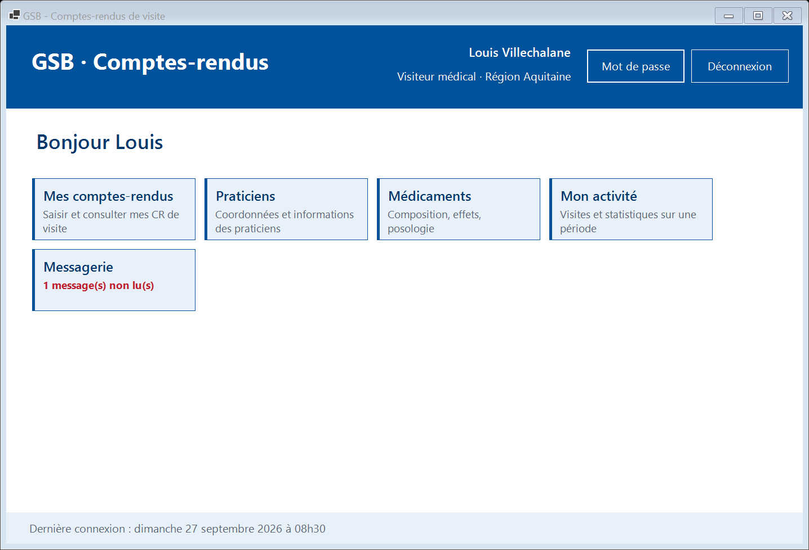
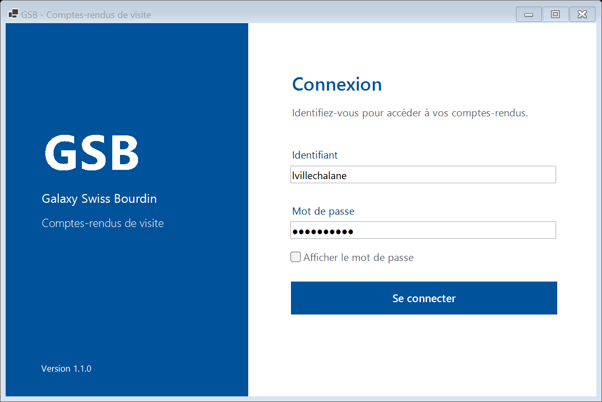
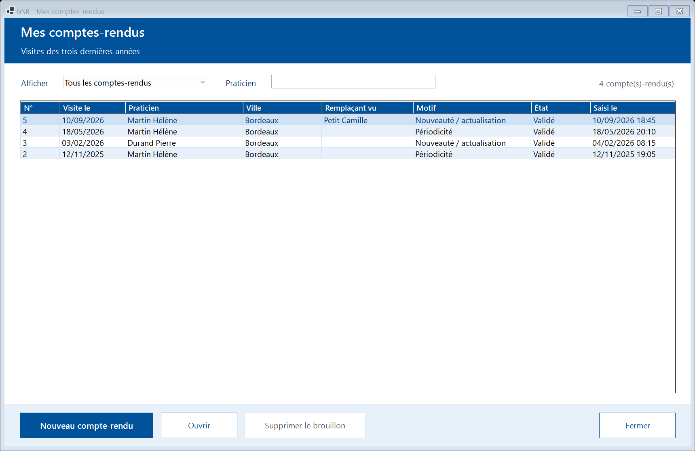
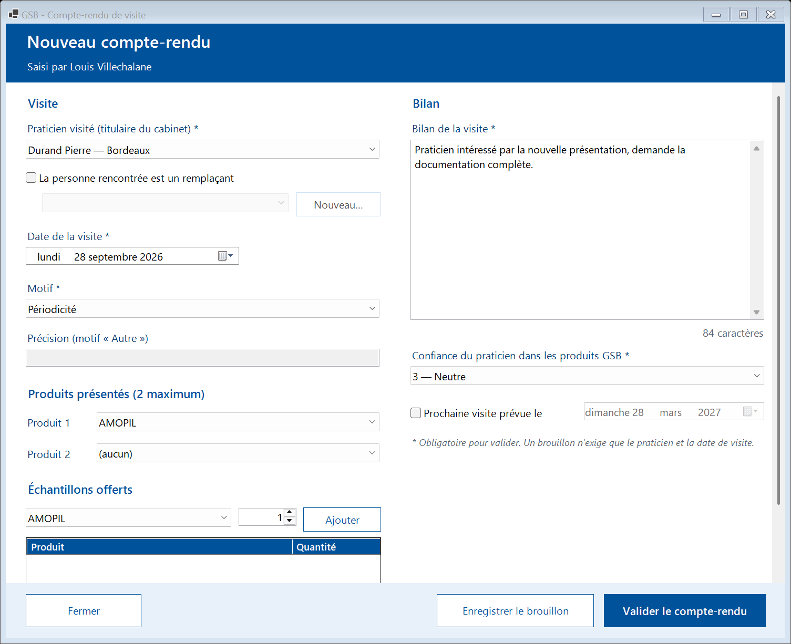
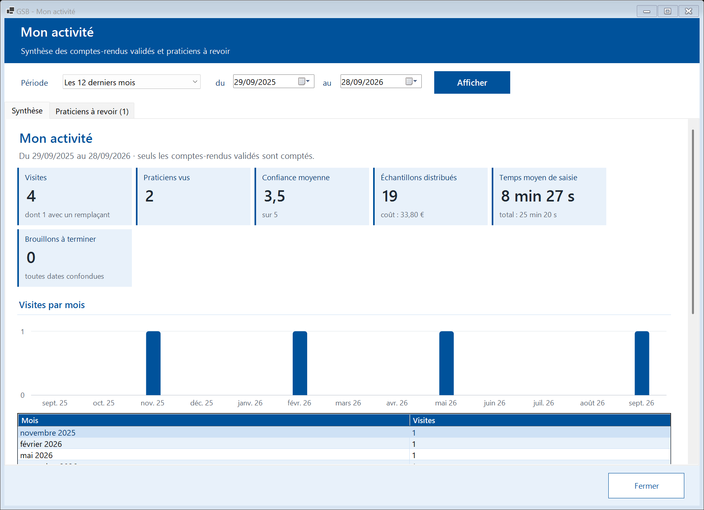
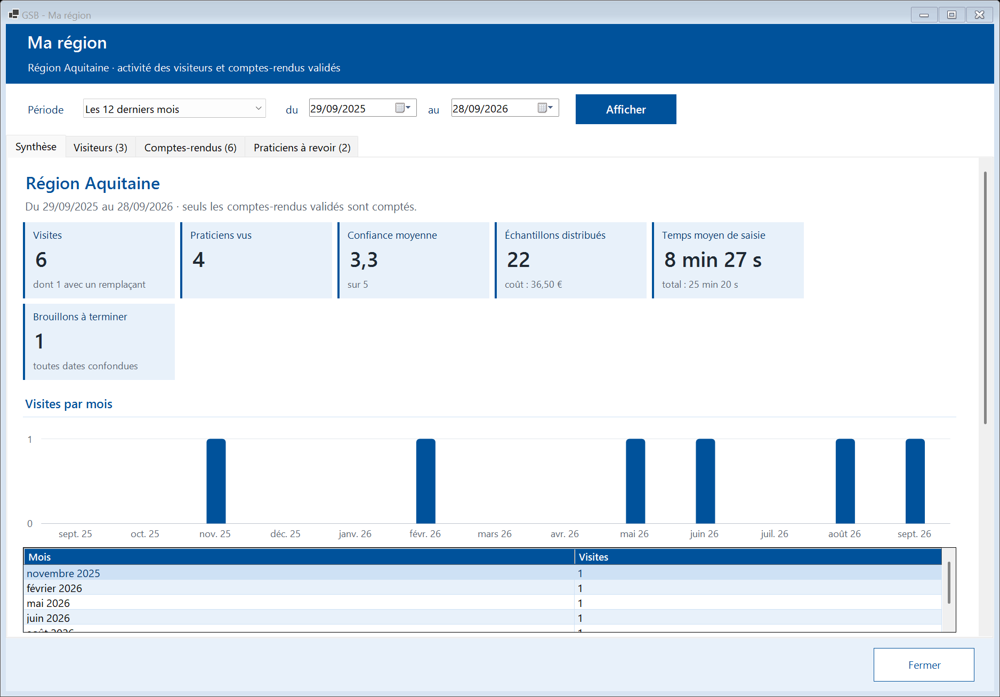
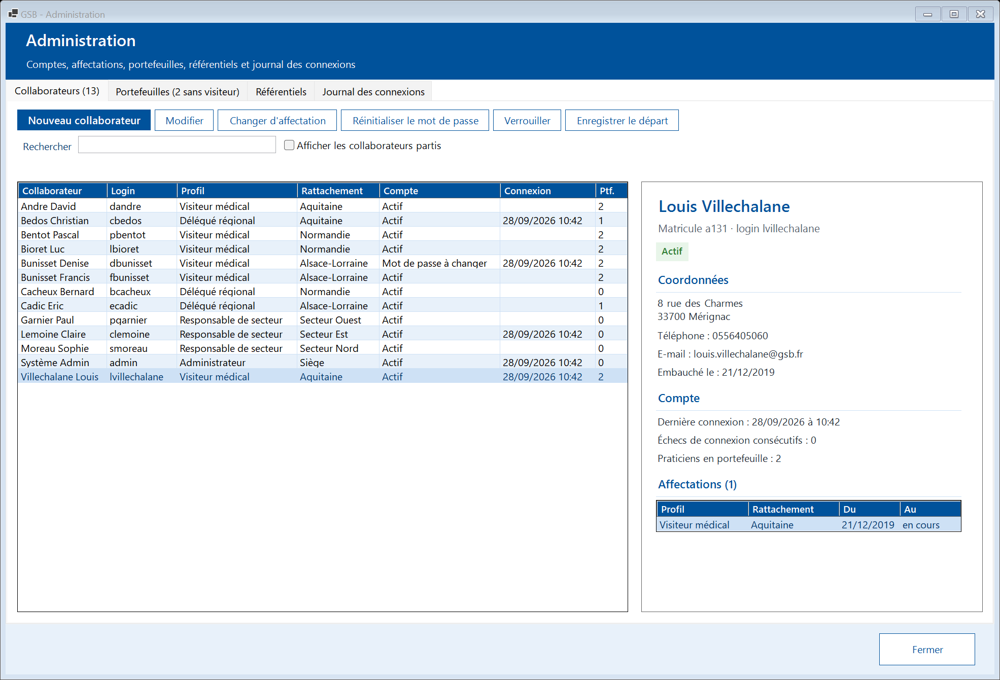
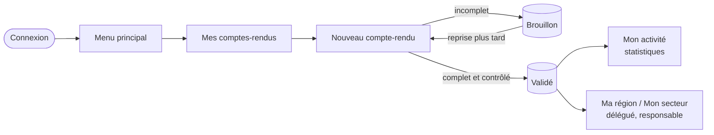
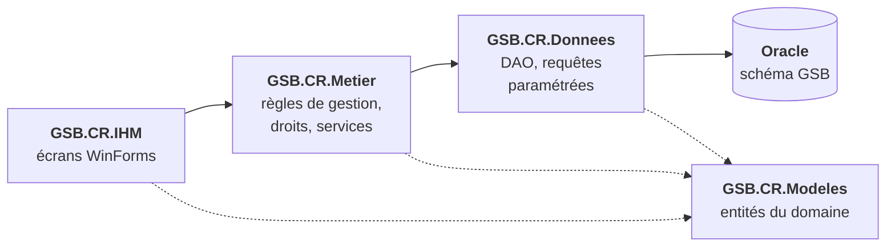

<div align="center">

# GSB-CR

**Comptes-rendus de visite des visiteurs médicaux — Galaxy Swiss Bourdin**

[](https://github.com/NeuTroNBZh/ProjetAPS3GSB/actions/workflows/ci.yml)


Application de bureau Windows pour **saisir, consulter et analyser les comptes-rendus de visite**
des visiteurs médicaux du laboratoire GSB, avec un suivi par région et par secteur.



</div>

---

## Sommaire

- [Le projet](#le-projet)
- [Fonctionnalités](#fonctionnalités)
- [Aperçu](#aperçu)
- [Comment ça marche](#comment-ça-marche)
- [Démarrage rapide](#démarrage-rapide)
- [Tests et intégration continue](#tests-et-intégration-continue)
- [Sécurité](#sécurité)
- [Documentation](#documentation)
- [Structure du dépôt](#structure-du-dépôt)
- [Versions](#versions)

## Le projet

Les visiteurs médicaux de GSB rencontrent des praticiens (médecins, pharmaciens…) pour leur présenter
les médicaments du laboratoire. Après chaque visite, ils rédigent un **compte-rendu** : praticien vu,
motif, produits présentés, échantillons offerts, bilan et niveau de confiance du praticien.

GSB-CR remplace la saisie papier par une application **simple, en bleu et blanc** (couleurs du logo GSB),
utilisable sur un poste de travail et **indépendante de l'intranet** de l'entreprise.

| | |
|---|---|
| **Contexte** | Atelier de professionnalisation — BTS SIO option SLAM |
| **Cahier des charges** | `GSB-Expression de besoins V3.docx` (synthèse dans [`docs/exigences.md`](docs/exigences.md)) |
| **Langage / interface** | VB.NET, Windows Forms, .NET 10 |
| **Base de données** | Oracle (SQL compatible 19c) |
| **Tests / CI** | MSTest, GitHub Actions |

## Fonctionnalités

Chaque collaborateur ne voit que les modules de son profil.

| Profil | Ce qu'il peut faire |
|---|---|
| 🩺 **Visiteur médical** | Saisir ses comptes-rendus (brouillon puis validation), consulter ses CR des 3 dernières années, fiches praticiens et médicaments, tableau de bord de son activité, praticiens à revoir |
| 🗺️ **Délégué régional** | Tout ce que fait un visiteur + activité de sa région (synthèse, visiteurs, CR, praticiens à revoir) et suivi des échantillons |
| 📊 **Responsable de secteur** | Activité de son secteur (toutes ses régions), consultation des échantillons, praticiens et médicaments |
| ⚙️ **Administrateur** | Comptes et affectations des collaborateurs, portefeuilles de praticiens, référentiels (praticiens, médicaments avec composition, interactions et posologie, motifs), journal des connexions |
| ✉️ **Tous** | Messagerie interne, changement de mot de passe |

Points forts :

- **Brouillons** : un compte-rendu peut être enregistré incomplet et terminé plus tard ; seuls les CR validés comptent dans les statistiques.
- **Contrôles de saisie clairs** : toutes les erreurs sont listées d'un coup, en français, avant tout enregistrement.
- **Historique conservé** : un changement d'affectation ou de portefeuille ne réécrit jamais le passé.
- **Tableaux de bord** : visites, praticiens vus, confiance moyenne, échantillons et leur coût, temps de saisie, graphique mensuel ; **export CSV** ouvert directement dans Excel.
- **Praticiens à revoir** : alerte selon la périodicité des visites (« À jour », « À revoir bientôt », « À revoir », « Jamais visité »).

## Aperçu

<table>
  <tr>
    <td width="50%"></td>
    <td width="50%"></td>
  </tr>
  <tr>
    <td align="center"><b>Connexion</b><br><sub>Identifiant et mot de passe, verrouillage après 5 échecs</sub></td>
    <td align="center"><b>Mes comptes-rendus</b><br><sub>CR des 3 dernières années, filtres au fil de la frappe</sub></td>
  </tr>
  <tr>
    <td></td>
    <td></td>
  </tr>
  <tr>
    <td align="center"><b>Saisie d'un compte-rendu</b><br><sub>Praticien, remplaçant, motif, produits, échantillons, bilan</sub></td>
    <td align="center"><b>Mon activité</b><br><sub>Indicateurs de la période et visites par mois</sub></td>
  </tr>
  <tr>
    <td></td>
    <td></td>
  </tr>
  <tr>
    <td align="center"><b>Ma région</b> (délégué)<br><sub>Synthèse, visiteurs, CR et praticiens à revoir de la région</sub></td>
    <td align="center"><b>Administration</b><br><sub>Collaborateurs, portefeuilles, référentiels, journal</sub></td>
  </tr>
</table>

Toutes les captures, écran par écran : [documentation utilisateur](docs/utilisateur/README.md).
Charte graphique et maquettes annotées : [`docs/maquettes/`](docs/maquettes/README.md).

## Comment ça marche

### Parcours type d'un visiteur



1. **Connexion** : le mot de passe est vérifié contre son empreinte en base ; un compte est verrouillé après 5 échecs, et un mot de passe provisoire doit être changé à la première connexion.
2. **Menu** : une tuile par module autorisé pour le profil connecté.
3. **Saisie** : le visiteur choisit un praticien de son portefeuille, le motif, jusqu'à 2 produits présentés et les échantillons offerts, puis rédige le bilan.
4. **Brouillon ou validation** : un brouillon peut rester incomplet ; la validation exige un CR complet. Un CR validé ne peut plus être supprimé.
5. **Suivi** : les CR validés alimentent les tableaux de bord du visiteur, de sa région et de son secteur.

### Architecture

Quatre projets, une couche chacun. L'interface n'accède **jamais** directement à la base.



| Projet | Rôle |
|---|---|
| `GSB.CR.Modeles` | Entités métier (`Collaborateur`, `RapportVisite`, `Praticien`, `Medicament`…), sans dépendance |
| `GSB.CR.Donnees` | Configuration, connexions Oracle, un DAO par domaine derrière une interface |
| `GSB.CR.Metier` | Règles de gestion, contrôle des droits par profil, authentification, statistiques |
| `GSB.CR.IHM` | Formulaires, thème bleu/blanc, point d'entrée |
| `GSB.CR.Tests` | Tests unitaires (services avec DAO en mémoire) et d'intégration (Oracle réel) |

La base protège aussi les données par des contraintes et des déclencheurs : un CR validé est forcément complet,
2 produits présentés au plus, confiance entre 1 et 5, date de visite jamais dans le futur, auteur d'un CR non modifiable, etc. Détails : [modèle de données](docs/modele-donnees.md)
et [diagrammes UML](docs/uml/README.md).

## Démarrage rapide

### Installer l'application (utilisateurs et service informatique)

Tout se télécharge depuis la page **[Releases](https://github.com/NeuTroNBZh/ProjetAPS3GSB/releases/latest)** :

| Paquet | Pour qui | Utilisation |
|---|---|---|
| `GSB-CR-<version>-poste-win-x64.zip` | Chaque poste Windows 10/11 | Décompresser, double-cliquer sur **`Installer.cmd`**, répondre aux questions (serveur, mot de passe du compte des postes). Runtime .NET inclus, raccourci créé sur le bureau |
| `GSB-CR-<version>-base-oracle.zip` | Administrateur de la base | Suivre `LISEZMOI.txt` : création du schéma, installation de production, compte des postes |

Déploiement sur de nombreux postes sans questions (`installer.ps1 -Silencieux`), mise à jour et désinstallation :
voir la [procédure de mise en exploitation](docs/mise-en-exploitation.md).

### Installation (poste de développement)

Prérequis : Windows 10 ou 11, [SDK .NET 10](https://dotnet.microsoft.com/download), une base Oracle 19c ou plus récente
avec un schéma `GSB`, et [SQLcl](https://www.oracle.com/database/sqldeveloper/technologies/sqlcl/) pour les scripts SQL.

```bash
# 1. Cloner le dépôt
git clone https://github.com/NeuTroNBZh/ProjetAPS3GSB.git
cd ProjetAPS3GSB

# 2. Renseigner les identifiants Oracle (fichier ignoré par Git)
copy src\GSB.CR.IHM\appsettings.Local.example.json src\GSB.CR.IHM\appsettings.Local.json
#    puis compléter Utilisateur et MotDePasse

# 3. Créer la base de développement avec le jeu d'essai (efface le schéma)
sql GSB/<mot_de_passe>@//<serveur>:1521/<service> @bdd/installer.sql

# 4. Compiler et lancer
dotnet build GSB.CR.slnx
dotnet run --project src/GSB.CR.IHM
```

Le serveur, le port et le service se règlent dans `src/GSB.CR.IHM/appsettings.json`.
Les comptes du jeu d'essai (un par profil, données fictives) sont listés dans [`docs/comptes-test.md`](docs/comptes-test.md).

### Publier une version

```powershell
pwsh ./scripts/preparer-livraison.ps1      # construit les deux paquets en local (publication/livraison-<version>/)
git tag vX.Y.Z && git push origin vX.Y.Z   # le workflow « Release » teste, construit et publie la release
```

## Tests et intégration continue

```bash
dotnet test GSB.CR.slnx --filter "TestCategory!=Integration"   # tests unitaires (comme la CI)
dotnet test GSB.CR.slnx                                          # tous les tests, base Oracle joignable
```

- **288 tests MSTest** : règles de gestion, droits par profil, validation des saisies, hachage des mots de passe, statistiques, et accès réels à Oracle pour les tests d'intégration.
- Les tests qui touchent Oracle portent la catégorie `Integration` et sont exclus de la CI.
- **GitHub Actions** compile la solution et exécute les tests unitaires à chaque push sur `main` et à chaque pull request.
- À chaque tag `vX.Y.Z`, le workflow **Release** vérifie la version, relance les tests, construit les paquets et publie la release avec ses notes.
- Règles côté base : `bdd/tests_regles.sql` vérifie les contraintes et déclencheurs.
- Recette fonctionnelle : [cahier de recette](docs/cahier-de-recette.md).

## Sécurité

- Mots de passe **jamais stockés en clair** : PBKDF2-SHA256, 100 000 itérations, sel aléatoire, comparaison en temps constant.
- Verrouillage du compte après **5 échecs**, même message d'erreur pour un identifiant inconnu ou un mot de passe faux.
- Mot de passe provisoire à changer obligatoirement à la première connexion.
- Requêtes SQL **toujours paramétrées** : aucune saisie n'est concaténée dans une requête.
- Identifiants de connexion **hors du dépôt** (`appsettings.Local.json`, ignoré par Git) ; en production, compte Oracle `GSB_APP` limité à la lecture et à l'écriture des données.
- Droits vérifiés dans la couche métier pour chaque action, pas seulement par l'affichage des menus.
- Journal des connexions consultable par l'administrateur.

## Documentation

| Document | Contenu |
|---|---|
| [Documentation utilisateur](docs/utilisateur/README.md) | Mode opératoire par module, avec captures |
| [Spécifications générales](docs/specifications-generales.md) | Acteurs, cas d'utilisation, règles de gestion |
| [Spécifications détaillées](docs/specifications-detaillees.md) | Écrans, champs, contrôles et messages |
| [Maquettes des écrans](docs/maquettes/README.md) | Charte graphique bleu/blanc, écrans clés annotés |
| [Exigences](docs/exigences.md) | Besoins numérotés `EX-xx` issus du cahier des charges |
| [Diagrammes UML](docs/uml/README.md) | Cas d'utilisation, classes, séquences, états, activités, composants, déploiement… |
| [Modèle de données](docs/modele-donnees.md) | Tables, contraintes, vues, déclencheurs |
| [Documentation technique](docs/technique/README.md) | Architecture, bibliothèques, conception, fiches pratiques |
| [Référence des classes](docs/technique/reference-classes.md) | Générée depuis les commentaires du code |
| [Décisions](docs/decisions.md) | Choix techniques et fonctionnels justifiés |
| [Cahier de recette](docs/cahier-de-recette.md) | Scénarios de tests fonctionnels |
| [Mise en exploitation](docs/mise-en-exploitation.md) | Installation, déploiement, sauvegardes, dépannage |
| [Gestion de projet](docs/gestion-de-projet.md) | Planning, versions, indicateurs, risques |
| [Glossaire](docs/glossaire.md) | Vocabulaire métier |

## Structure du dépôt

```
ProjetAPS3GSB/
├── src/
│   ├── GSB.CR.Modeles/     entités du domaine
│   ├── GSB.CR.Donnees/     accès Oracle (configuration, connexions, DAO)
│   ├── GSB.CR.Metier/      règles de gestion et services
│   └── GSB.CR.IHM/         application WinForms
├── tests/
│   └── GSB.CR.Tests/       tests unitaires et d'intégration (MSTest)
├── bdd/                    scripts Oracle : tables, vues, déclencheurs, référentiels, jeu d'essai, installation
├── deploiement/            installateur et désinstallateur des postes, notices des paquets
├── scripts/                livraison, publication, hachage de mot de passe, référence des classes
├── docs/                   documentation du projet
├── .github/workflows/      intégration continue et publication des releases
├── Directory.Build.props   réglages communs et numéro de version
└── CHANGELOG.md            journal des versions
```

## Versions

Numérotation `MAJEUR.MINEUR.CORRECTIF`, un tag Git `vX.Y.Z` par version livrée.
Le détail de chaque version est dans le [journal des versions](CHANGELOG.md).

| Version | Contenu principal |
|---|---|
| **1.1.0** | Export CSV des statistiques ; composition, interactions et posologie des médicaments : 44 exigences sur 44 |
| 1.0.0 | Première version complète : installateur des postes, release GitHub automatique, documentation finalisée |
| 0.9.0 | Mise en exploitation : installation de production, compte Oracle des postes, paquet d'installation |
| 0.8.0 | Module Administration |
| 0.1.0 → 0.7.0 | Socle, connexion, module Visiteur, Délégué, Responsable, messagerie |

---

<div align="center">
<sub>Projet réalisé par Louis — BTS SIO SLAM · Atelier de professionnalisation · Galaxy Swiss Bourdin (entreprise fictive)</sub>
</div>
