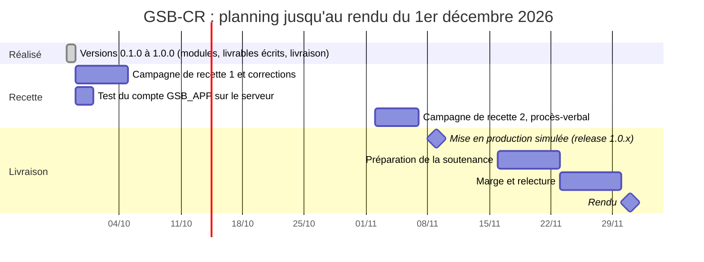

# Gestion de projet — GSB-CR

Projet d'AP (BTS SIO SLAM), réalisé seul. Rendu le **1er décembre 2026**. Ce document décrit l'organisation, le découpage en versions, le suivi, le planning jusqu'au rendu et la gestion des risques. Il est mis à jour à chaque version.

## 1. Organisation

### Démarche

Démarche **itérative et incrémentale** : le besoin est découpé en exigences numérotées (`EX-xx`, [exigences.md](exigences.md)), regroupées en **versions livrables** de plus en plus complètes. Chaque version :

1. part d'une exigence ou d'un module de la [roadmap](roadmap.md), par ordre de priorité du cahier des charges (module Visiteur d'abord) ;
2. commence par les règles de gestion et leurs **tests unitaires** (couche Métier), puis l'accès aux données, puis les écrans ;
3. est vérifiée (tests automatisés, tests d'intégration sur Oracle, contrôle visuel des écrans) ;
4. est documentée (décisions, exigences, UML, journal des versions) puis **livrée** : numéro de version, entrée dans le [CHANGELOG](../CHANGELOG.md), tag Git.

### Outils

| Outil | Usage |
|---|---|
| GitHub (dépôt privé) | Sources, scripts SQL, documentation, historique ; tags de version |
| GitHub Actions | Intégration continue : compilation et tests unitaires à chaque envoi sur `main` |
| Notion | Suivi des tâches (base « Tâches » : statut, priorité, échéance) et fiche du projet |
| Miro | Modélisation UML 2 partagée (17 diagrammes et carte des vues) |
| PlantUML | Sources versionnées des diagrammes (`docs/uml`) |
| SQLcl | Scripts de la base Oracle |

### Rôles

Projet individuel : toutes les fonctions (analyse, conception, développement, tests, documentation, exploitation) sont tenues par la même personne. Le cahier des charges tient lieu de maîtrise d'ouvrage ; les points non précisés ont été tranchés et tracés dans [decisions.md](decisions.md) (22 décisions).

## 2. Découpage en versions (réalisé)

| Version | Date | Contenu | Exigences | Commits cumulés | Tests |
|---|---|---|---|---|---|
| 0.1.0 | 28/09/2026 | Documentation, solution VB.NET en 4 couches, intégration continue, base Oracle complète (28 tables, 6 vues, 3 déclencheurs) | EX-03, EX-05 | 5 | 4 |
| 0.2.0 | 28/09/2026 | Connexion sécurisée, verrouillage, changement de mot de passe, menu par profil | EX-01, EX-02, EX-05 à EX-09 | 10 | 69 |
| 0.3.0 | 28/09/2026 | Saisie, modification et consultation des comptes-rendus (brouillon, validation, remplaçant, temps de saisie) | EX-10 à EX-20, EX-25 à EX-29 | 16 | 121 |
| 0.4.0 | 28/09/2026 | Fiches praticiens et médicaments, périodicité des visites | EX-21, EX-22 | 21 | 147 |
| 0.5.0 | 28/09/2026 | Synthèse d'activité, praticiens à revoir | EX-23, EX-24 | 26 | 159 |
| 0.6.0 | 28/09/2026 | Modules Délégué et Responsable, échantillons (dotations, contrôle de stock) | EX-30 à EX-35, EX-40, EX-41 | 31 | 192 |
| 0.7.0 | 28/09/2026 | Messagerie interne | EX-50 | 36 | 208 |
| 0.8.0 | 28/09/2026 | Module Administration | EX-70 à EX-74 | 43 | 240 |
| 0.9.0 | 28/09/2026 | Mise en exploitation, cahier de recette, documentation utilisateur, UML 2 complet | EX-61 | 51 | 248 |
| 1.0.0 | 28/09/2026 | Spécifications, maquettes, documentation technique, README ; installateur des postes et release GitHub automatique | EX-60, EX-62 | 61 | 248 |

Les colonnes « Commits » et « Tests » sont mesurées sur les tags Git (`git rev-list --count vX.Y.Z`, cas de test MSTest).

## 3. Indicateurs de suivi (version 1.0.0)

| Indicateur | Valeur |
|---|---|
| Exigences fonctionnelles réalisées | 43 sur 44 (EX-51, export CSV, optionnelle, non réalisée) ; EX-73 partielle (composition et posologie par script) |
| Tests automatisés | 248, 0 échec |
| Intégration continue | Verte sur toutes les versions |
| Règles vérifiées par la base | 21 sur 21 (`bdd/tests_regles.sql`) |
| Scénarios de recette | 59 rédigés, campagne 1 à dérouler |
| Diagrammes UML 2 | 17 (13 types sur 14) |
| Décisions tracées | 23 |
| Livraison | Release GitHub automatique : paquet poste (runtime inclus, installateur) et kit base Oracle |

## 4. Planning jusqu'au rendu

La version 1.0.0 est livrée le 28/09 : tous les modules et tous les livrables écrits sont terminés, en avance sur le planning initial. Les semaines restantes servent aux deux campagnes de recette (corrections éventuelles livrées en 1.0.x), à la mise en production simulée et à la préparation de la soutenance, avec une large marge.

| Semaine | Travail prévu | Livrable |
|---|---|---|
| 29/09 – 04/10 | Dérouler la campagne de recette 1 ; corriger les anomalies ; tester `GSB_APP` sur le serveur | Procès-verbal (campagne 1), version 1.0.x si corrections |
| 05/10 – 11/10 | ~~Spécifications fonctionnelles générales~~ — réalisé le 28/09 | `docs/specifications-generales.md` |
| 12/10 – 18/10 | ~~Spécifications fonctionnelles détaillées~~ — réalisé le 28/09 | `docs/specifications-detaillees.md` |
| 19/10 – 23/10 | ~~Maquettes des écrans~~ — réalisé le 28/09 | `docs/maquettes/` |
| 24/10 – 01/11 | ~~Documentation technique~~ — réalisé le 28/09 | `docs/technique/` |
| 02/11 – 08/11 | Campagne de recette 2 ; mise en production simulée à partir des paquets de la release | Procès-verbal final, release **v1.0.x** si corrections |
| 16/11 – 22/11 | Soutenance : support, scénario de démonstration, comptes de démonstration | Support de présentation |
| 23/11 – 30/11 | Marge : imprévus, relecture de l'ensemble des livrables | — |
| **01/12** | **Rendu** | Dépôt, documents, application |

Le suivi au jour le jour se fait dans la base « Tâches » de Notion (statut À faire, En cours ou Fait, avec l'échéance de chaque livrable) ; la [roadmap](roadmap.md) est cochée à chaque livrable terminé.

## 5. Risques

| Risque | Probabilité | Impact | Prévention ou réponse |
|---|---|---|---|
| Serveur Oracle indisponible (VM, conteneur, réseau Tailscale) | Moyenne | Fort : plus de tests d'intégration ni de démonstration | Scripts d'installation complets et rejouables (`bdd/installer.sql`) ; possibilité de réinstaller sur une autre base Oracle Free en quelques minutes |
| Écart de version Oracle (serveur en 26ai, cahier des charges en 19c) | Moyenne | Moyen : SQL refusé sur une 19c | SQL volontairement limité aux fonctions 19c (D-11), pas de type BOOLEAN ni de syntaxe récente |
| Perte de données ou du poste de travail | Faible | Fort | Tout est versionné sur GitHub, poussé à chaque commit ; identifiants seuls hors dépôt (à recréer depuis le modèle) |
| Fuite d'identifiants | Faible | Fort | `appsettings.Local.json` ignoré par Git, jamais inclus dans le paquet ; compte `GSB_APP` sans droits sur la structure |
| Régression lors d'une correction | Moyenne | Moyen | 248 tests automatisés relancés par la CI à chaque envoi ; cahier de recette rejouable |
| Retard sur les livrables d'analyse | Moyenne | Moyen | Développement déjà terminé ; une semaine de marge avant le rendu |
| Exigence mal comprise | Faible | Moyen | Exigences numérotées et tracées (matrice de couverture du cahier de recette) ; décisions documentées |

## 6. Gestion de configuration

- **Dépôt** : une branche principale `main`, protégée par l'intégration continue ; commits courts, messages en français, préfixés par la couche concernée (« Métier : », « IHM : », « Docs : »…).
- **Versions** : numérotation `MAJEUR.MINEUR.CORRECTIF`, définie une seule fois dans `Directory.Build.props` (affichée sur l'écran de connexion) ; chaque version livrée a une entrée dans le CHANGELOG et un tag `vX.Y.Z`. La version 1.0.0 est la première version complète ; chaque tag déclenche la publication automatique de la release GitHub (paquets et notes de version).
- **Base de données** : scripts numérotés dans `bdd/` ; installation de développement (`installer.sql`) et de production (`installer_production.sql`) séparées ; toute évolution future du schéma passera par un script de migration versionné (`bdd/migrations/`).
- **Secrets** : jamais dans le dépôt ; modèles `*.example.json` versionnés à la place.
