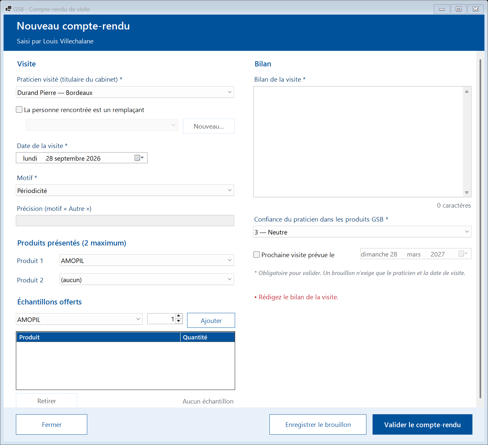

# Maquettes des écrans — GSB-CR

Ce document réunit la **charte graphique** de l'application et les **maquettes annotées** des écrans clés.
Les maquettes fil de fer modifiables sont sur le tableau Miro du projet (zone « Maquettes des écrans ») ;
les captures ci-dessous montrent les écrans réalisés, qui les respectent.

- Charte imposée par le cahier des charges : **bleu et blanc**, couleurs du logo GSB, interface simple et conviviale.
- Toutes les valeurs (couleurs, polices, styles des boutons et des grilles) sont définies **une seule fois**
  dans le module `Theme` (`src/GSB.CR.IHM/Theme.vb`) : aucun écran ne choisit ses couleurs lui-même.
- Mode opératoire détaillé de chaque écran : [documentation utilisateur](../utilisateur/README.md).
  Champs, contrôles et messages : [spécifications détaillées](../specifications-detaillees.md).

## 1. Charte graphique

### Couleurs

| Nom (`Theme`) | Valeur | Usage |
|---|---|---|
| `BleuGsb` | `#00529B` | Bandeaux de fenêtre, boutons principaux, en-têtes de grille, titres de section |
| `BleuFonce` | `#00386C` | Survol des boutons principaux, titres, texte d'une ligne sélectionnée |
| `BleuClair` | `#E8F1FA` | Tuiles du menu, lignes alternées des grilles, pieds de fenêtre, survol des boutons secondaires |
| `BleuSurvol` | `#CEE1F5` | Ligne sélectionnée, quadrillage des grilles, bouton désactivé |
| `Blanc` | `#FFFFFF` | Fond des fenêtres et des zones de saisie |
| `TexteGris` | `#5A626E` | Textes secondaires, aides, compteurs, texte d'un bouton désactivé |
| `Erreur` | `#BE1E2D` | Erreurs de saisie, messages non lus, alertes |

Les pastilles de périodicité des visites associent toujours **une couleur et un texte**
(« À jour », « À revoir bientôt », « À revoir », « Jamais visité ») : l'information ne repose jamais sur la couleur seule.

### Typographie

Police unique : **Segoe UI** (police système de Windows, aucune installation).

| Élément | Style |
|---|---|
| Titre de fenêtre (bandeau) | Segoe UI Semibold 18 pt, blanc sur bleu GSB |
| Sous-titre du bandeau | Segoe UI 11 pt, blanc |
| Titre de section | Segoe UI Semibold 11,5 pt, bleu GSB |
| Texte courant, libellés, saisies | Segoe UI 10 pt |
| Bouton principal | Segoe UI Semibold 10,5 pt |
| En-têtes de grille | Segoe UI Semibold 9,5 pt, blanc sur bleu GSB |

### Composants

| Composant | Règle |
|---|---|
| Bandeau | En haut de chaque fenêtre : titre + sous-titre en blanc sur bleu GSB |
| Bouton principal | Fond bleu GSB, texte blanc, survol bleu foncé. **Un seul par fenêtre** (l'action attendue) |
| Bouton secondaire | Fond blanc, texte et bordure bleu GSB, survol bleu clair |
| Bouton désactivé | Grisé (bordure bleu de sélection, texte gris) : non applicable, mais toujours visible |
| Grille | En-têtes bleus, lignes alternées blanc / bleu clair, sélection de la ligne entière, lecture seule, double-clic pour ouvrir |
| Tuile de module | Fond bleu clair, bordure bleu GSB, titre + description ; une tuile par module autorisé |
| Erreurs de saisie | Liste en rouge dans la fenêtre, toutes les erreurs en une fois ; rien n'est enregistré |
| Pied de fenêtre | Bande bleu clair portant les boutons (« Fermer » à gauche, actions à droite) |

### Principes d'ergonomie

1. Une fenêtre par module, ouverte depuis une tuile du menu ; « Fermer » ramène toujours au menu.
2. Champs obligatoires marqués d'un astérisque `*`.
3. Listes filtrées au fil de la frappe ; fiche détaillée à droite de la liste quand il y en a une.
4. Chargements en arrière-plan : la fenêtre reste utilisable pendant les accès à la base.
5. Affichage adapté aux écrans réglés à 125 % et 150 % (mise à l'échelle DPI).

## 2. Maquettes annotées des écrans clés

Les numéros renvoient aux repères des maquettes fil de fer (Miro).

### Connexion

| Repère | Élément | Règle |
|---|---|---|
| 1 | Identifiant | Seule zone accessible sans connexion (EX-01) |
| 2 | Mot de passe | Masqué ; même message pour un identifiant inconnu ou un mot de passe faux ; compte verrouillé après 5 échecs |
| 3 | Afficher le mot de passe | Permet de vérifier la saisie |
| 4 | Se connecter | Bouton principal, la touche Entrée valide ; formulaire désactivé pendant la vérification |
| 5 | Version | Version de l'application (support, mises à jour) |

### Menu principal

| Repère | Élément | Règle |
|---|---|---|
| 1 | Utilisateur connecté | Nom, profil et rattachement (région ou secteur) |
| 2 | Mot de passe, Déconnexion | Changement du mot de passe à tout moment ; retour à l'écran de connexion |
| 3 | Tuiles | Une tuile par module autorisé pour le profil (EX-02), module principal en premier |
| 4 | Messagerie | Nombre de messages non lus, en rouge |
| 5 | Dernière connexion | Permet de repérer un accès qui ne serait pas le sien |

Le menu d'un délégué ajoute les tuiles de sa région : [capture](../utilisateur/images/04_menu_delegue.png).

### Mes comptes-rendus

| Repère | Élément | Règle |
|---|---|---|
| 1 | Filtres | État (tous, brouillons, validés) et praticien ou ville, appliqués au fil de la frappe |
| 2 | Compteur | Nombre de comptes-rendus affichés |
| 3 | Grille | CR des 3 dernières années (EX-20), du plus récent au plus ancien ; double-clic pour ouvrir |
| 4 | Nouveau compte-rendu | Action principale |
| 5 | Supprimer le brouillon | Actif seulement sur un brouillon ; un CR validé ne se supprime pas (EX-29) |

### Saisie d'un compte-rendu

| Repère | Élément | Règle |
|---|---|---|
| 1 | Praticien visité | Praticiens actifs du portefeuille, triés par nom (EX-28) |
| 2 | Remplaçant | On garde le titulaire du cabinet et on choisit la personne vue, ou on crée sa fiche (EX-16, EX-28) |
| 3 | Date de la visite | Pas de date future (EX-27) ; aujourd'hui par défaut |
| 4 | Motif, précision | « Autre » en dernier ; précision active seulement pour « Autre » (EX-12) |
| 5 | Produits présentés | Deux au plus, différents (EX-13) |
| 6 | Échantillons offerts | Indépendants des produits présentés, quantité à l'unité (EX-14) |
| 7 | Bilan | Texte libre avec compteur de caractères |
| 8 | Confiance, prochaine visite | Confiance de 1 « Très réticent » à 5 « Très confiant » (EX-15) ; prochaine visite facultative (EX-19) |
| 9 | Erreurs | Toutes listées en rouge ; rien n'est enregistré tant qu'il en reste |
| 10 | Boutons | Brouillon incomplet accepté, validation complète exigée (EX-25) ; « Fermer » demande confirmation si la saisie n'est pas enregistrée |

Affichage des erreurs de saisie :

## 3. Autres écrans

Ils reprennent les mêmes composants (bandeau, filtres, grille, fiche, pied de fenêtre) :

| Module | Écrans |
|---|---|
| Visiteur | [Praticiens](../utilisateur/images/13_praticiens.png) · [Médicaments](../utilisateur/images/14_medicaments.png) · [Mon activité](../utilisateur/images/15_mon_activite.png) · [Praticiens à revoir](../utilisateur/images/16_praticiens_a_revoir.png) |
| Délégué | [Synthèse](../utilisateur/images/20_ma_region_synthese.png) · [Visiteurs](../utilisateur/images/21_ma_region_visiteurs.png) · [Comptes-rendus](../utilisateur/images/22_ma_region_comptes_rendus.png) · [À revoir](../utilisateur/images/23_ma_region_a_revoir.png) · [Échantillons](../utilisateur/images/24_echantillons.png) |
| Responsable | [Mon secteur](../utilisateur/images/30_mon_secteur.png) · [Visiteurs](../utilisateur/images/31_mon_secteur_visiteurs.png) |
| Messagerie | [Reçus](../utilisateur/images/40_messagerie_recus.png) · [Envoyés](../utilisateur/images/41_messagerie_envoyes.png) · [Nouveau message](../utilisateur/images/42_nouveau_message.png) |
| Administration | [Collaborateurs](../utilisateur/images/50_admin_collaborateurs.png) · [Portefeuilles](../utilisateur/images/51_admin_portefeuilles.png) · [Référentiels](../utilisateur/images/52_admin_referentiels.png) · [Journal](../utilisateur/images/53_admin_journal.png) |
| Commun | [Changement du mot de passe](../utilisateur/images/02_changement_mot_de_passe.png) |
