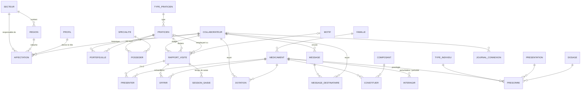

# Modèle de données — GSB-CR

Schéma Oracle **GSB** (serveur `100.109.217.110`, service `FREEPDB1`), SQL compatible 19c.
Scripts : `bdd/` — installation complète par `bdd/installer.sql` (voir en bas de page).

**28 tables · 6 vues · 3 déclencheurs · 21 règles testées** (`bdd/tests_regles.sql`).

## Vue d'ensemble



## MLD

Notation : **clé primaire** en gras, `#` = clé étrangère, `?` = facultatif.

### 1. Organisation

| Table | Colonnes |
|---|---|
| SECTEUR | **sec_code**, sec_libelle |
| REGION | **reg_code**, reg_nom, #sec_code |
| PROFIL | **pro_code** (VIS, DEL, RES, ADM), pro_libelle |
| COLLABORATEUR | **col_matricule**, col_nom, col_prenom, col_adresse?, col_cp?, col_ville?, col_telephone?, col_email?, col_date_embauche, col_date_depart?, col_login (unique), col_mdp (haché), col_mdp_a_changer (O/N), col_nb_echecs, col_verrouille (O/N), col_derniere_connexion? |
| AFFECTATION | **aff_id**, #col_matricule, #pro_code, #reg_code?, #sec_code?, aff_date_debut, aff_date_fin? |

### 2. Praticiens

| Table | Colonnes |
|---|---|
| TYPE_PRATICIEN | **typ_code**, typ_libelle, typ_lieu |
| PRATICIEN | **pra_num**, pra_nom, pra_prenom, pra_adresse?, pra_cp?, pra_ville?, pra_telephone?, pra_email?, pra_coef_notoriete?, #typ_code, pra_actif (O/N), pra_date_maj |
| SPECIALITE | **spe_code**, spe_libelle |
| POSSEDER | **#pra_num, #spe_code**, pos_diplome?, pos_coef_prescription? |
| PORTEFEUILLE | **#pra_num, ptf_date_debut**, #col_matricule, ptf_date_fin? |

### 3. Produits

| Table | Colonnes |
|---|---|
| FAMILLE | **fam_code**, fam_libelle |
| MEDICAMENT | **med_depot_legal**, med_nom_commercial (unique), #fam_code, med_effets?, med_contre_indic?, med_prix_echantillon, med_date_commercialisation?, med_actif (O/N) |
| COMPOSANT | **cmp_code**, cmp_libelle |
| CONSTITUER | **#med_depot_legal, #cmp_code**, cst_quantite, cst_unite |
| INTERAGIR | **#med_perturbateur, #med_perturbe**, itr_description? |
| PRESENTATION | **pre_code**, pre_libelle |
| DOSAGE | **dos_code**, dos_quantite, dos_unite |
| TYPE_INDIVIDU | **tin_code**, tin_libelle |
| PRESCRIRE | **#med_depot_legal, #tin_code, #pre_code, #dos_code**, prs_posologie |

### 4. Comptes-rendus

| Table | Colonnes |
|---|---|
| MOTIF | **mot_code**, mot_libelle, mot_ordre, mot_actif (O/N) |
| RAPPORT_VISITE | **rap_num**, #col_matricule, #pra_num (titulaire), #pra_num_remplacant?, rap_date_visite, #mot_code?, rap_motif_autre?, rap_bilan?, rap_coef_confiance? (1–5), rap_date_prochaine_visite?, rap_etat (B/V), rap_date_saisie, rap_date_modif?, rap_date_validation? |
| PRESENTER | **#rap_num, #med_depot_legal**, pst_ordre (1 ou 2) |
| OFFRIR | **#rap_num, #med_depot_legal**, off_quantite |
| SESSION_SAISIE | **ses_id**, #rap_num, #col_matricule, ses_debut, ses_fin |

### 5. Échantillons, communication, sécurité

| Table | Colonnes |
|---|---|
| DOTATION | **dot_id**, #col_matricule (visiteur), #med_depot_legal, dot_mois (1er du mois), dot_quantite, #col_matricule_saisie (délégué), dot_date_saisie — unique (visiteur, médicament, mois) |
| MESSAGE | **msg_id**, #col_expediteur, msg_objet, msg_contenu, msg_date_envoi |
| MESSAGE_DESTINATAIRE | **#msg_id, #col_matricule**, dst_date_lecture? |
| JOURNAL_CONNEXION | **jco_id**, jco_login, #col_matricule?, jco_date, jco_succes (O/N) |

## Choix de conception

| Besoin (CDC) | Solution retenue |
|---|---|
| Hiérarchie visiteur → délégué → responsable, turn-over, « on conserve la trace de l'évolution » | Table **AFFECTATION** historisée (profil + région ou secteur, dates). Une même région peut revenir. Le profil courant = l'affectation sans date de fin. |
| « Un médecin ne reçoit jamais deux visites du même labo » | **PORTEFEUILLE** historisé ; index unique : un seul visiteur en cours par praticien. Transfert = on clôt la ligne et on en ouvre une autre. |
| Remplaçant vu à la place du titulaire | Le remplaçant est un **PRATICIEN** à part entière (sans cabinet) ; le rapport garde le titulaire (`pra_num`) **et** la personne vue (`pra_num_remplacant`). Son historique le suit s'il s'installe. |
| Motif standardisé + « autre » | Table **MOTIF** (liste modifiable) ; précision obligatoire si et seulement si `AUTRE`. |
| 2 produits présentés maximum | `pst_ordre` ∈ {1, 2} + unique (rapport, ordre) → impossible d'en mettre 3, sans déclencheur. |
| Échantillons à l'unité, indépendants des produits présentés | Table **OFFRIR** séparée de PRESENTER. |
| Coefficient de confiance ≠ notoriété ≠ prescription | Confiance sur le **rapport** (1–5), notoriété sur le **praticien**, prescription par **spécialité** (POSSEDER). |
| CR complets (bilan, médecin, date) mais saisie parfois en plusieurs fois | État **brouillon (B) / validé (V)** : un brouillon peut être incomplet, un CR validé est forcément complet (contrainte). Seuls les CR validés comptent dans les statistiques. |
| Dates de saisie ; temps de saisie peut-être compté en heures sup | `rap_date_saisie` / `rap_date_modif` / `rap_date_validation` automatiques + **SESSION_SAISIE** (chaque ouverture du formulaire) → vue `V_TEMPS_SAISIE`. |
| CR modifiables, seule la dernière version compte | Mise à jour en place, horodatée par déclencheur ; l'auteur ne peut pas être changé. |
| Obligation légale de suivi des échantillons, contrôle de stock | **DOTATION** mensuelle saisie par le délégué + vue `V_STOCK_ECHANTILLON` (attribué vs distribué). |
| Composition, interactions, posologie par type d'individu / présentation / dosage | CONSTITUER, INTERAGIR, PRESCRIRE (+ PRESENTATION, DOSAGE, TYPE_INDIVIDU). |
| Outil de communication entre personnes ou vers un groupe | MESSAGE + MESSAGE_DESTINATAIRE (un envoi à une région = une ligne par destinataire, avec date de lecture). |
| Page d'accueil = identification uniquement, sécurité | Mot de passe **haché PBKDF2**, compteur d'échecs, verrouillage, changement forcé du mot de passe, **JOURNAL_CONNEXION**. |
| Données sur 3 ans, praticiens / produits qui disparaissent | Rien n'est supprimé : `pra_actif`, `med_actif`, `mot_actif`, `col_date_depart`. |

## Vues

| Vue | Usage |
|---|---|
| `V_AFFECTATION_EN_COURS` | Profil, région et secteur actuels de chaque collaborateur présent (connexion, droits, filtres délégué/responsable) |
| `V_RAPPORT_DETAIL` | Rapports avec noms du visiteur, du praticien, du remplaçant et libellé du motif |
| `V_DERNIERE_VISITE` | Dernière visite validée par praticien, jours écoulés, prochaine visite prévue (périodicité 6–8 mois) |
| `V_ACTIVITE_MENSUELLE` | Par collaborateur et par mois : visites, praticiens distincts, échantillons, coût |
| `V_STOCK_ECHANTILLON` | Par visiteur, médicament et mois : attribué, distribué, écart |
| `V_TEMPS_SAISIE` | Temps total de saisie par rapport (en secondes) |

## Règles de gestion

| Règle | Où | Code |
|---|---|---|
| Auteur, praticien et date de visite obligatoires | NOT NULL | EX-10, EX-11 |
| CR validé ⇒ motif, bilan et confiance renseignés | `CK_RAPPORT_COMPLET` | EX-11 |
| Précision obligatoire ssi motif AUTRE | `CK_RAPPORT_MOTIF_AUTRE` | EX-12 |
| 2 produits présentés maximum | `CK_PRESENTER_ORDRE` + `UQ_PRESENTER_ORDRE` | EX-13 |
| Quantité d'échantillons > 0 | `CK_OFFRIR_QTE` | EX-14 |
| Confiance entre 1 et 5 | `CK_RAPPORT_CONFIANCE` | EX-15 |
| Remplaçant ≠ titulaire | `CK_RAPPORT_REMPLACANT` | EX-16 |
| Date de saisie / modification / validation automatiques | `TRG_RAPPORT_VISITE_BIU` | EX-17, EX-18 |
| Prochaine visite après la visite | `CK_RAPPORT_PROCHAINE` | EX-19 |
| Date de visite pas dans le futur | `TRG_RAPPORT_VISITE_BIU` (ORA-20001) | — |
| Auteur d'un CR non modifiable | `TRG_RAPPORT_VISITE_BIU` (ORA-20002) | EX-10 |
| Seul un délégué (ou responsable/admin) attribue des échantillons | `TRG_DOTATION_BI` (ORA-20003) | EX-33 |
| Une affectation en cours par collaborateur ; un délégué par région ; un responsable par secteur | index uniques conditionnels | — |
| Un seul visiteur en cours par praticien | `UX_PORTEFEUILLE_EN_COURS` | — |
| VIS/DEL rattachés à une région, RES à un secteur, ADM à rien | `CK_AFFECTATION_RATTACHEMENT` | EX-02 |

Règles laissées à la couche **Métier** (VB.NET) : consultation limitée aux 3 dernières années, droits de lecture selon le profil (un visiteur ne voit que ses CR, un délégué ceux de sa région, un responsable ceux de son secteur), verrouillage après N échecs, envoi d'un message à un groupe.

## Mots de passe

Format stocké dans `col_mdp` : `PBKDF2-SHA256$<itérations>$<sel base64>$<clé base64>`
— PBKDF2 HMAC-SHA256, **100 000** itérations, sel aléatoire de **16 octets**, clé de **32 octets**.
En VB.NET : `Rfc2898DeriveBytes.Pbkdf2(motDePasse, sel, 100000, HashAlgorithmName.SHA256, 32)` puis comparaison avec `CryptographicOperations.FixedTimeEquals`.

## Installation / remise à zéro

```bash
# depuis la racine du dépôt (SQLcl) — ATTENTION : supprime toutes les données du schéma GSB
echo "" | sql -S GSB/<mdp>@//100.109.217.110:1521/FREEPDB1 @bdd/installer.sql
# vérifier les règles
echo "" | sql -S GSB/<mdp>@//100.109.217.110:1521/FREEPDB1 @bdd/tests_regles.sql
```

| Script | Rôle |
|---|---|
| `00_creation_utilisateur.sql` | Création du schéma GSB (en SYSTEM, une seule fois) |
| `01_tables.sql` | Tables, contraintes, index |
| `02_vues.sql` | Vues |
| `03_triggers.sql` | Déclencheurs |
| `04_jeu_essai.sql` | Données de test (comptes : `docs/comptes-test.md`) |
| `99_suppression.sql` | Supprime tous les objets du schéma |
| `installer.sql` | 99 → 01 → 02 → 03 → 04 + recompilation |
| `tests_regles.sql` | 21 tentatives interdites qui doivent toutes être refusées |
