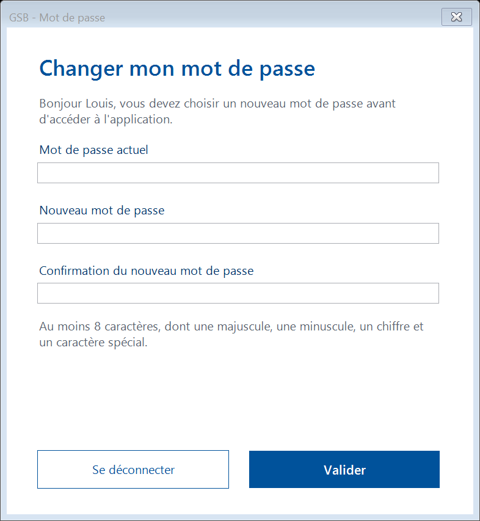
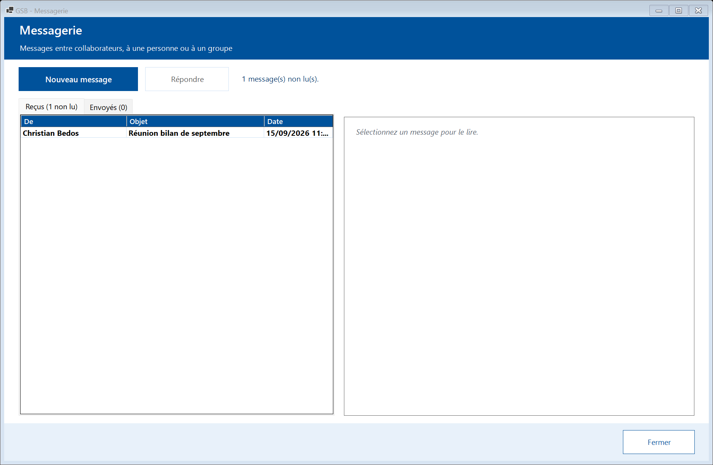
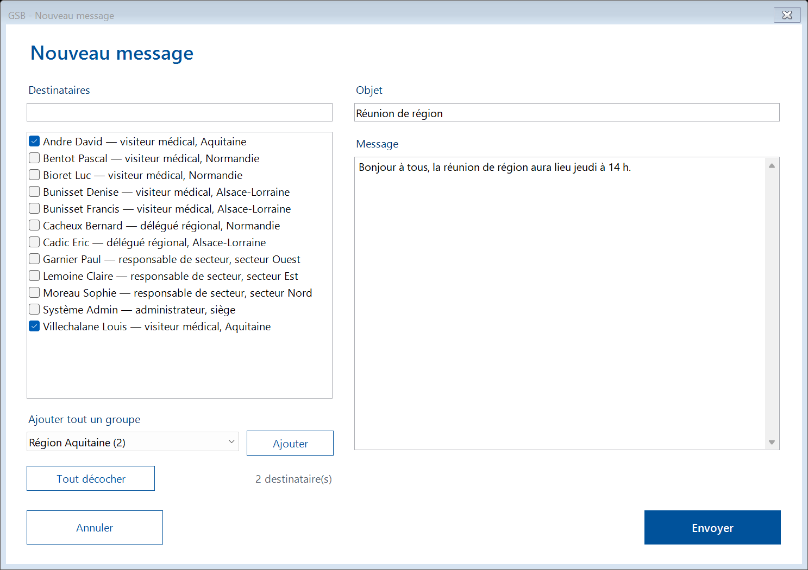

# Spécifications fonctionnelles détaillées — GSB-CR

Version décrite : 1.1.0. Ce document détaille chaque écran : champs, contrôles, actions et messages. Les cas d'utilisation (`UC-xx`) et les règles de gestion (`RG-xx`) sont définis dans les [spécifications générales](specifications-generales.md) ; les captures d'écran viennent de la [documentation utilisateur](utilisateur/README.md) ; le modèle de données est dans [modele-donnees.md](modele-donnees.md).

## 0. Conventions communes à tous les écrans

- **Charte** : bandeau bleu GSB (#00529B) avec le titre et un sous-titre ; fond blanc ; bouton principal bleu plein, boutons secondaires blancs bordés de bleu ; un bouton désactivé est grisé.
- **Obligatoire** : libellé suivi de `*`.
- **Erreurs de saisie** : listées en rouge, une par ligne, dans la fenêtre ; rien n'est enregistré tant qu'il reste une erreur.
- **Erreur d'accès aux données** : fenêtre d'avertissement « Le serveur est indisponible. Réessayez dans quelques instants. » ; aucune donnée partielle n'est enregistrée.
- **Chargements** : les accès à la base se font en arrière-plan ; l'écran reste utilisable.
- **Listes** : sélection d'une ligne entière ; le double-clic équivaut au bouton d'ouverture ; les colonnes s'adaptent à la largeur de la fenêtre.
- **Dates** : format jj/mm/aaaa ; heures hh:mm.

## 1. Connexion (UC-01)

| Champ | Contrôle | Obligatoire | Règle |
|---|---|:---:|---|
| Identifiant | Zone de texte | ✓ | Comparé sans tenir compte des majuscules |
| Mot de passe | Zone de texte masquée | ✓ | RG-01 |
| Afficher le mot de passe | Case à cocher | | Affiche le mot de passe en clair |

| Action | Effet |
|---|---|
| « Se connecter » (ou Entrée) | Désactive le formulaire pendant la vérification, puis ouvre le changement de mot de passe (si provisoire) ou le menu |

| Situation | Message |
|---|---|
| Champ vide, login inconnu ou mot de passe faux | « Identifiant ou mot de passe incorrect. » ; à 2 essais ou moins avant le verrouillage, le nombre d'essais restants est indiqué ; le mot de passe est effacé |
| Compte verrouillé (RG-02) | « Votre compte est verrouillé. Contactez l'administrateur. » |
| Compte inactif (RG-03) | « Ce compte n'est plus actif. Contactez l'administrateur. » |
| Base injoignable | « Le serveur est indisponible. Réessayez dans quelques instants. » |

Le panneau de gauche affiche le logo, le nom du laboratoire et la **version** de l'application.

## 2. Changer mon mot de passe (UC-02)

| Champ | Contrôle | Obligatoire | Règle |
|---|---|:---:|---|
| Mot de passe actuel | Masqué | ✓ | Doit correspondre au mot de passe enregistré |
| Nouveau mot de passe | Masqué | ✓ | RG-05, différent de l'actuel |
| Confirmation du nouveau mot de passe | Masqué | ✓ | Identique au nouveau |

La règle RG-05 est rappelée sous les champs. En mode **obligatoire** (mot de passe provisoire), le texte d'accueil l'indique et le bouton secondaire est « Se déconnecter » (retour à l'écran de connexion) ; sinon « Annuler ».

Messages : « Le mot de passe actuel est incorrect. », « La confirmation ne correspond pas au nouveau mot de passe. », « Le nouveau mot de passe doit être différent de l'actuel. », puis chaque règle de RG-05 non respectée.

## 3. Menu principal

- **Bandeau** : prénom et nom, libellé du profil et rattachement (« Région Aquitaine », « Secteur Ouest »), boutons « Mot de passe » (UC-02) et « Déconnexion » (retour à la connexion).
- **Tuiles** : une par module autorisé (tableau des droits, spécifications générales §2), dans un ordre propre au profil : le module principal d'abord (Mes comptes-rendus pour le visiteur et le délégué, Mon secteur pour le responsable, Administration pour l'administrateur), la Messagerie en dernier. Chaque tuile porte un titre et une description ; la tuile Messagerie affiche en rouge « n message(s) non lu(s) ».
- **Pied** : « Dernière connexion : <date> à <heure> » ou « Première connexion ».

## 4. Mes comptes-rendus (UC-14, UC-13)

| Zone | Détail |
|---|---|
| Afficher | Liste : « Tous les comptes-rendus », « Brouillons à terminer », « Comptes-rendus validés » |
| Praticien | Filtre immédiat sur le nom du praticien ou la ville |
| Compteur | « n compte(s)-rendu(s) » |
| Liste | N°, Visite le, Praticien, Ville, Remplaçant vu, Motif, État, Saisi le — comptes-rendus de l'auteur des 3 dernières années (RG-15), du plus récent au plus ancien |

| Action | Condition | Effet |
|---|---|---|
| « Nouveau compte-rendu » | — | Ouvre l'écran 5 vide |
| « Ouvrir » (ou double-clic) | Une ligne sélectionnée | Ouvre l'écran 5 sur le compte-rendu |
| « Supprimer le brouillon » | Ligne à l'état Brouillon | Confirmation « Supprimer définitivement le brouillon du <date> (<praticien>) ? » (Non par défaut), puis suppression |
| « Fermer » | — | Retour au menu |

Après enregistrement dans l'écran 5, la liste est rechargée et le compte-rendu concerné sélectionné.

## 5. Compte-rendu de visite (UC-10, UC-11, UC-12)

Bandeau : « Nouveau compte-rendu » ou « Compte-rendu n° <n> », avec « Saisi par <auteur> ». L'ouverture démarre une session de saisie (RG-13).

### Partie « Visite »

| Champ | Contrôle | Brouillon | Validation | Règles et valeurs |
|---|---|:---:|:---:|---|
| Praticien visité (titulaire du cabinet) | Liste déroulante « Nom Prénom — Ville », triée par nom | ✓ | ✓ | Praticiens **actifs** du portefeuille de l'auteur (RG-21, RG-22) |
| La personne rencontrée est un remplaçant | Case à cocher | | | Active la liste des remplaçants et le bouton « Nouveau… » |
| Remplaçant | Liste de tous les praticiens | si case cochée | si case cochée | Différent du titulaire (RG-12) |
| « Nouveau… » | Bouton | | | Ouvre l'écran 6 ; le remplaçant créé est sélectionné |
| Date de la visite | Sélecteur de date | ✓ | ✓ | Pas dans le futur (RG-12) ; par défaut aujourd'hui |
| Motif | Liste des motifs actifs, « Autre » en dernier | | ✓ | RG-55 |
| Précision (motif « Autre ») | Zone de texte, active seulement pour « Autre » | | si « Autre » | 200 caractères au plus |

### Produits et échantillons

| Champ | Contrôle | Règles |
|---|---|---|
| Produit 1, Produit 2 | Listes des médicaments, avec « (aucun) » | Au plus 2, différents (RG-12) |
| Échantillon : produit, quantité, « Ajouter » | Liste des médicaments commercialisés, compteur de 1 à 9 999 | Ajoute une ligne ; pour un produit déjà présent, la quantité s'ajoute (9 999 au plus) |
| Tableau des échantillons | Produit, Quantité ; « Retirer » enlève la ligne sélectionnée | Indépendant des produits présentés (EX-14) ; « Aucun échantillon » si vide |

### Partie « Bilan »

| Champ | Contrôle | Validation | Règles |
|---|---|:---:|---|
| Bilan de la visite | Zone de texte multiligne, compteur de caractères | ✓ | 4 000 octets au plus |
| Confiance du praticien dans les produits GSB | Liste : « (à renseigner) », « 1 — Très réticent », « 2 — Réticent », « 3 — Neutre », « 4 — Confiant », « 5 — Très confiant » | ✓ | RG-11 |
| Prochaine visite prévue le | Case à cocher + date | | Postérieure à la visite (RG-12) ; par défaut 6 mois après |

Rappel affiché : « * Obligatoire pour valider. Un brouillon n'exige que le praticien et la date de visite. »

### Actions

| Action | Effet |
|---|---|
| « Valider le compte-rendu » | Contrôles RG-11 et RG-12, enregistrement à l'état Validé (transaction), date de validation, fin de session ; fermeture et retour à la liste |
| « Enregistrer le brouillon » | Contrôles RG-12 seulement ; enregistrement à l'état Brouillon. Bouton masqué pour un compte-rendu déjà validé (le service refuse aussi : « Un compte-rendu validé ne peut pas repasser en brouillon. ») |
| « Fermer » | Si des modifications ne sont pas enregistrées : « Les modifications non enregistrées seront perdues. Fermer quand même ? » |

Messages de contrôle (affichés en rouge sous le bilan) : « Choisissez le praticien visité. », « Indiquez la date de la visite. », « La date de visite ne peut pas être dans le futur. », « Le remplaçant doit être différent du praticien titulaire. », « Choisissez le motif de la visite. », « Précisez le motif « Autre ». », « Une visite comporte au plus 2 produits présentés. », « Le même produit ne peut pas être présenté deux fois. », « Un même produit apparaît plusieurs fois dans les échantillons. », « La quantité d'échantillons de <produit> doit être supérieure à zéro. », « Rédigez le bilan de la visite. », « Le bilan est trop long. », « Indiquez le coefficient de confiance du praticien. », « La prochaine visite doit être postérieure à la date de visite. »

Un compte-rendu d'un autre collaborateur ne s'ouvre jamais dans cet écran (« Vous ne pouvez ouvrir que vos propres comptes-rendus. ») ; délégués et responsables le consultent dans une fiche en lecture seule (écran 10).

## 6. Nouveau remplaçant (UC-11)

| Champ | Obligatoire | Règles |
|---|:---:|---|
| Nom, Prénom | ✓ | 50 caractères au plus |
| Type | ✓ | Liste des types de praticien |
| Téléphone, E-mail | | |

Information : « Sa fiche sera conservée pour suivre son historique, même s'il s'installe ailleurs. » Actions : « Créer la fiche », « Annuler ».

## 7. Praticiens (UC-03)

| Zone | Détail |
|---|---|
| Rechercher | Nom, prénom ou ville ; recherche au fil de la frappe |
| Seulement mon portefeuille | Affichée et cochée par défaut pour un visiteur ou un délégué ; absente pour les autres profils |
| Inclure les praticiens inactifs | Décochée par défaut |
| Liste | Praticien, Type, Ville, Suivi par, Dernière visite, Périodicité (« À jour » en vert, « À revoir bientôt » en orange, « À revoir » en rouge, « Jamais visité » en gris) — 500 résultats au plus |
| Fiche (à droite) | Nom, type, pastille de périodicité ; Coordonnées ; Profil (notoriété, tableau spécialité, diplôme, coefficient de prescription) ; Suivi (visiteur, dernière visite, prochaine visite conseillée) ; Historique des visites validées (date, visiteur, motif, confiance, remarque) |

## 8. Médicaments (UC-04)

| Zone | Détail |
|---|---|
| Rechercher | Nom commercial ou dépôt légal |
| Famille | Liste des familles, ou toutes |
| Inclure les médicaments retirés | Décochée par défaut |
| Liste | Nom commercial, Famille, Dépôt légal, Prix éch. |
| Fiche | Nom, famille, statut ; effets ; contre-indications ; composition (composant, quantité, unité) ; interactions ; posologie (type d'individu, présentation, dosage, texte) |

## 9. Mon activité (UC-15, UC-16, UC-17)

| Zone | Détail |
|---|---|
| Période | Liste : « Ce mois-ci », « Le mois dernier », « Les 3 derniers mois » (par défaut), « Les 12 derniers mois », « Les 3 dernières années » ; dates « du » et « au » modifiables |
| « Afficher » | Recalcule la synthèse ; « La date de début doit précéder la date de fin. » ; « La consultation est limitée aux trois dernières années (depuis le <date>). » |
| Onglet Synthèse | Indicateurs : Visites (dont avec remplaçant), Praticiens vus, Confiance moyenne (sur 5), Échantillons distribués (et coût), Temps moyen de saisie (et total), Brouillons à terminer ; graphique « Visites par mois » avec tableau ; Motifs des visites ; Produits présentés ; Échantillons par produit |
| Onglet Praticiens à revoir (n) | Situation, Praticien, Ville, Dernière visite, Il y a (jours), Prochaine prévue, Téléphone ; ordre RG-20 ; « Saisir un compte-rendu » ouvre l'écran 5 avec le praticien présélectionné |
| « Exporter en CSV » | Actif dès qu'une synthèse est affichée. Boîte « Exporter les statistiques » : nom proposé `GSB-activite-<périmètre>-<début>-au-<fin>.csv`, dossier Documents. Fichier : en-tête (périmètre, période, date d'export), indicateurs, visites par mois (tous les mois, zéro compris), motifs, produits présentés, échantillons (dépôt légal, produit, quantité, coût) ; RG-16. Messages : « Statistiques exportées dans : <chemin> » ; « Impossible d'écrire le fichier… Vérifiez qu'il n'est pas ouvert dans Excel, ou choisissez un autre dossier. » |

## 10. Ma région / Mon secteur (UC-20, UC-21, UC-30, UC-31, UC-17)

Même écran pour le délégué (« Ma région », périmètre : sa région) et le responsable (« Mon secteur », périmètre : toutes les régions du secteur). Période : comme l'écran 9.

| Onglet | Contenu | Actions |
|---|---|---|
| Synthèse | Indicateurs du périmètre et visites par mois (comme l'écran 9) | — |
| Visiteurs (n) | Visiteur, [Région pour le secteur], Visites, Praticiens vus, Confiance moy., Échantillons, Coût, Brouillons, Dernière visite ; visiteur sans visite signalé | « Voir son activité » (ou double-clic) : fiche de synthèse du visiteur |
| Comptes-rendus (n) | Visite le, Visiteur, Praticien, Ville, Remplaçant vu, Motif ; filtres « Tous les visiteurs » ou un visiteur, et praticien ou ville | « Consulter le compte-rendu » : fiche en lecture seule (visite, remplaçant, motif, produits, échantillons, bilan, confiance, prochaine visite) |
| Praticiens à revoir (n) | Comme l'écran 9, avec la colonne « Suivi par » | — |

« Exporter en CSV » : comme l'écran 9, avec en plus la section « Activité par visiteur » (visiteur, profil, région, visites, praticiens vus, confiance moyenne, échantillons, coût, brouillons, dernière visite).

Seuls les comptes-rendus validés du périmètre sont visibles (RG-30) ; un compte-rendu hors périmètre est refusé (« Ce compte-rendu n'appartient pas à votre équipe. »).

## 11. Échantillons (UC-22, UC-23)

| Zone | Détail |
|---|---|
| Mois | Du mois prochain à 12 mois en arrière ; mois en cours par défaut |
| Seulement les dépassements | Filtre sur les écarts négatifs |
| Compteur | « n ligne(s) · n dépassement(s) » (en rouge s'il y a des dépassements) |
| Tableau | Visiteur, Produit, Attribué, Distribué, Écart, Situation (« Conforme » ou « Dépassement de n » en rouge) — RG-32 |
| Panneau « Attribuer des échantillons » (délégué seulement) | Visiteur (de la région), Produit, Quantité attribuée (1 à 999 999) ; « Enregistrer la dotation », « Supprimer la dotation » |

Messages : « Choisissez le produit. », « La quantité attribuée doit être supérieure à zéro. », « Choisissez un visiteur de votre région. », « Les dotations se saisissent du mois prochain jusqu'à 12 mois en arrière. » Pour le responsable, le panneau de saisie n'est pas affiché.

## 12. Messagerie (UC-05)

| Zone | Détail |
|---|---|
| « Nouveau message » | Ouvre l'écran 13 |
| « Répondre » | Actif sur un message reçu sélectionné ; écran 13 pré-rempli (destinataire = expéditeur, objet « RE : … », texte cité) |
| Compteur | « n message(s) non lu(s). » ou « Aucun message non lu. » |
| Onglet Reçus (n non lu) | De, Objet, Date ; messages non lus en gras |
| Onglet Envoyés (n) | À, Objet, Lu par (nombre de destinataires l'ayant lu), Date |
| Lecture (à droite) | Objet, expéditeur, date, destinataires avec date de lecture, texte ; l'ouverture d'un message reçu le marque lu |

## 13. Nouveau message (UC-05)

| Champ | Détail | Règles |
|---|---|---|
| Destinataires | Filtre, puis liste à cocher « Nom Prénom — profil, rattachement » ; « Tout décocher » ; compteur « n destinataire(s) » | 1 à 500 (RG-40) |
| Ajouter tout un groupe | Liste des régions et secteurs (le sien en premier, avec l'effectif) ; « Ajouter » coche tous leurs membres | — |
| Objet | Zone de texte | Obligatoire, 100 caractères au plus |
| Message | Zone multiligne | Obligatoire, 4 000 octets au plus |

Actions : « Envoyer », « Annuler ». Messages : « Choisissez au moins un destinataire. », « Indiquez l'objet du message. », « Le message est vide. », « Le message est trop long. »

## 14. Administration (UC-40 à UC-44)

Écran à quatre onglets ; chaque action ouvre une fenêtre de saisie (titre, explication, champs, bouton de confirmation) ; le résultat s'affiche dans la barre d'état en bas ; une opération refusée affiche la liste des erreurs.

### 14.1 Collaborateurs

| Zone | Détail |
|---|---|
| Rechercher | Filtre sur toutes les colonnes |
| Afficher les collaborateurs partis | Décochée par défaut |
| Liste | Collaborateur, Login, Profil, Rattachement, Compte (Actif, Verrouillé en rouge, Mot de passe à changer, Parti le …), Connexion, Ptf. (taille du portefeuille) |
| Fiche | Nom, matricule, login, pastille d'état ; coordonnées ; compte (dernière connexion, échecs consécutifs, taille du portefeuille) ; tableau des affectations (profil, rattachement, du, au) |

| Action | Champs de la fenêtre | Règles et effets |
|---|---|---|
| Nouveau collaborateur | Matricule*, Nom*, Prénom*, Login*, Adresse, Code postal, Ville, Téléphone, E-mail, Date d'embauche*, Profil ; Région (visiteur, délégué) ou Secteur (responsable) | RG-50, RG-51 ; embauche non future ; mot de passe provisoire affiché et copié (RG-06) ; doublon : message explicite |
| Modifier | Mêmes champs sauf matricule (lecture seule) et affectation | RG-50 |
| Changer d'affectation | Profil, Région ou Secteur, « À partir du » (demain par défaut) | RG-53 ; rappel : le portefeuille n'est pas transféré |
| Réinitialiser le mot de passe | Confirmation (Non par défaut) | Nouveau mot de passe provisoire, compte déverrouillé |
| Verrouiller / Déverrouiller | — | Libellé selon l'état ; RG-52 |
| Enregistrer le départ | Date de départ (aujourd'hui par défaut) | Non future ; pas avant le début de l'affectation en cours ; avertissement si le portefeuille n'est pas vide ; RG-52 |

### 14.2 Portefeuilles

| Zone | Détail |
|---|---|
| Visiteur | Liste des visiteurs et délégués en poste : « Nom Prénom — Région (taille) » |
| Portefeuille (gauche) | Praticien, Ville, Dernière visite, Périodicité |
| Praticiens sans visiteur (droite) | Praticien, Type, Ville, Dernière visite ; sélection multiple ; aucune ligne pré-sélectionnée |

| Action | Condition | Effet |
|---|---|---|
| Confier les praticiens sélectionnés à ce visiteur | Visiteur choisi et au moins un praticien sans visiteur sélectionné | Ouvre les suivis au jour même |
| Réattribuer le praticien sélectionné… | Un praticien du portefeuille sélectionné | Fenêtre : nouveau visiteur (même région proposée en premier) |
| Transférer tout le portefeuille… | Portefeuille non vide | Fenêtre : nouveau visiteur ; transaction ; « n praticien(s) transféré(s) à … » |

Messages : « Choisissez au moins un praticien. », « Choisissez deux collaborateurs différents. », « Le portefeuille doit être confié à un visiteur ou à un délégué en poste. », « Ce portefeuille est vide. »

### 14.3 Référentiels

| Sous-onglet | Liste | Actions et champs |
|---|---|---|
| Praticiens | Praticien, Type, Ville, Suivi par, État (inactifs en gris) ; recherche | Nouveau praticien, Modifier : Nom*, Prénom*, Type*, Adresse, Code postal (5 chiffres), Ville, Téléphone, E-mail (format vérifié), Coefficient de notoriété (0 à 9 999,99), Praticien actif ; Désactiver / Réactiver |
| Médicaments | Nom commercial, Famille, Dépôt légal, Prix éch., Statut | Modifier le prix ou le statut : prix (0 à 999 999,99 €, 2 décimales), Commercialisé ; « Composition, interactions, posologie » : fenêtre 14.5 |
| Motifs de visite | Code, Libellé, Statut | Nouveau motif : Code (2 à 6 lettres, AUTRE réservé), Libellé (60 caractères au plus) ; Modifier : libellé, Proposé à la saisie (« Autre » reste actif) |

### 14.4 Journal des connexions

| Zone | Détail |
|---|---|
| Du, au | 30 derniers jours par défaut |
| Login | Filtre facultatif |
| Échecs seulement | Case à cocher |
| « Afficher » | Recharge la liste ; compteur « n tentative(s), dont n échec(s) » ; « affichage limité, affinez la période » au-delà de 1 000 lignes |
| Liste | Date et heure (à la seconde), Login saisi, Collaborateur (ou « (login inconnu) »), Résultat (« Connexion réussie », « Échec » en rouge) |

### 14.5 Composition, interactions et posologie d'un médicament

Bandeau : nom commercial, dépôt légal et famille. Trois onglets, chacun avec son nombre de lignes ; « Retirer » demande confirmation et n'est actif que sur une ligne sélectionnée. Règle RG-56.

| Onglet | Liste | Actions et champs |
|---|---|---|
| Composition (n) | Composant, Quantité, Unité | « Ajouter un composant » : Composant* (liste), Quantité* (jusqu'à 3 décimales), Unité* (10 caractères, « mg » par défaut) ; « Nouveau composant… » : Code* (2 à 4 lettres ou chiffres, mis en majuscules), Nom* (60 caractères) |
| Interactions (n) | Autre médicament, Sens (« perturbe l'effet de… » ou « voit son effet perturbé par… »), Description | « Ajouter une interaction » : Autre médicament* (liste sans le médicament affiché), Sens*, Description (500 caractères) |
| Posologie (n) | Type d'individu, Présentation, Dosage, Posologie | « Ajouter une posologie » : Type d'individu*, Présentation*, Dosage* (listes), Posologie* (200 caractères) ; « Nouveau dosage… » : Quantité*, Unité* ; code calculé (« 500MG », « 0V5PC » pour 0,5 %) |

Messages : « Choisissez le composant. » ; « La quantité doit être strictement positive. » ; « L'unité est obligatoire (10 caractères au plus : mg, g, ml, %…). » ; « Ce composant figure déjà dans la composition : retirez-le d'abord pour changer sa quantité. » ; « Un médicament ne peut pas interagir avec lui-même. » ; « Cette interaction est déjà enregistrée. » ; « Une posologie existe déjà pour ce type d'individu, cette présentation et ce dosage. » ; « Ce code de composant existe déjà. » ; « Ce dosage existe déjà : choisissez-le dans la liste. »
