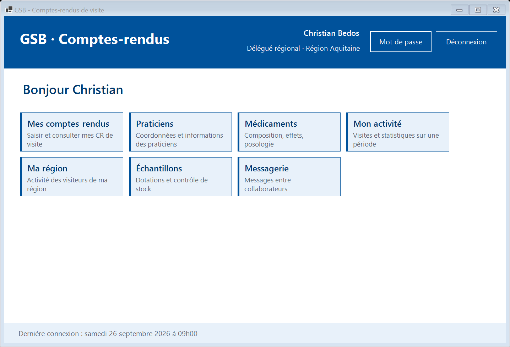

# Démarrer : connexion, mot de passe, menu

[← Sommaire](README.md)

## Se connecter

1. Lancez **GSB-CR** depuis le raccourci du bureau.
2. Saisissez votre **identifiant** (login) et votre **mot de passe**. La case « Afficher le mot de passe » permet de vérifier la saisie.
3. Cliquez sur **« Se connecter »** (ou appuyez sur Entrée).

La fenêtre de connexion est la seule accessible sans identification.

À savoir :

- Après **5 erreurs de mot de passe consécutives**, votre compte est **verrouillé**. Seul l'administrateur peut le déverrouiller. Les dernières tentatives indiquent combien d'essais il vous reste.
- Un collaborateur qui a quitté l'entreprise ne peut plus se connecter ; ses comptes-rendus restent conservés.
- Toutes les tentatives de connexion, réussies ou non, sont enregistrées dans un journal consulté par l'administrateur.

## Changer son mot de passe

À la **première connexion**, ou après une réinitialisation par l'administrateur, la fenêtre « Changer mon mot de passe » s'ouvre d'office : vous ne pouvez pas accéder à l'application sans choisir un nouveau mot de passe.

1. Saisissez le **mot de passe actuel** (le mot de passe provisoire reçu de l'administrateur).
2. Saisissez deux fois le **nouveau mot de passe**.
3. Cliquez sur **« Valider »**.

Le nouveau mot de passe doit contenir **au moins 8 caractères, dont une majuscule, une minuscule, un chiffre et un caractère spécial**. « Se déconnecter » ferme l'application sans rien changer.

Vous pouvez changer votre mot de passe à tout moment avec le bouton **« Mot de passe »** du menu principal.

## Le menu principal

Le menu affiche une **tuile par module** autorisé pour votre profil. Cliquez sur une tuile pour ouvrir le module ; à sa fermeture, vous revenez au menu.

- En haut à droite : votre nom, votre profil et votre rattachement (région ou secteur).
- La tuile **Messagerie** indique le nombre de messages non lus.
- En bas : la date de votre dernière connexion. Si elle ne correspond pas à une connexion de votre part, prévenez l'administrateur.
- **« Déconnexion »** ramène à l'écran de connexion (à faire en quittant votre poste).

Menu d'un délégué régional, qui ajoute « Ma région » et « Échantillons » aux modules du visiteur :

