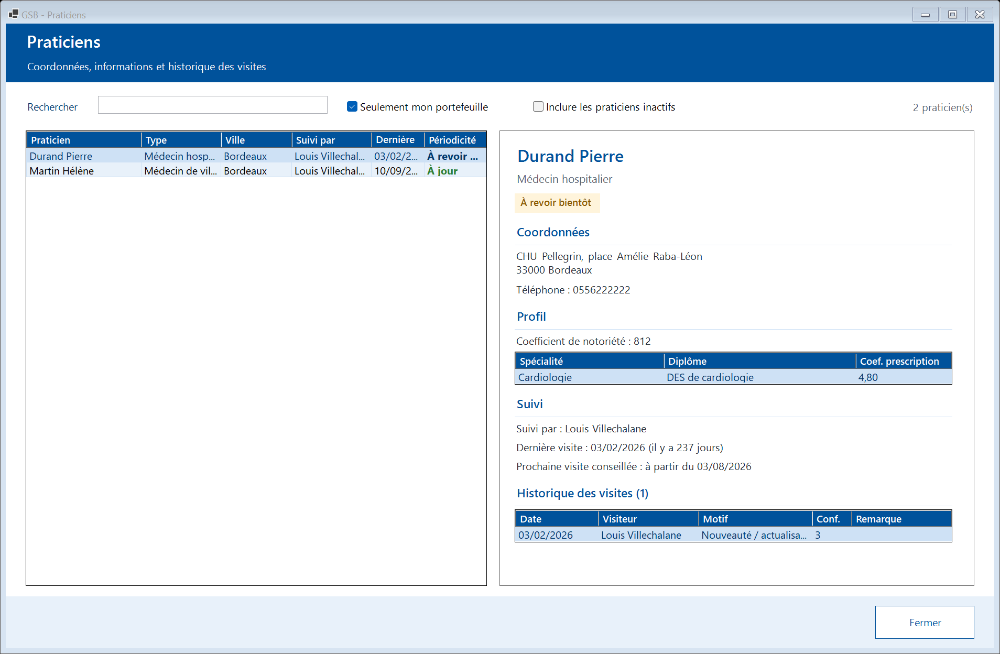
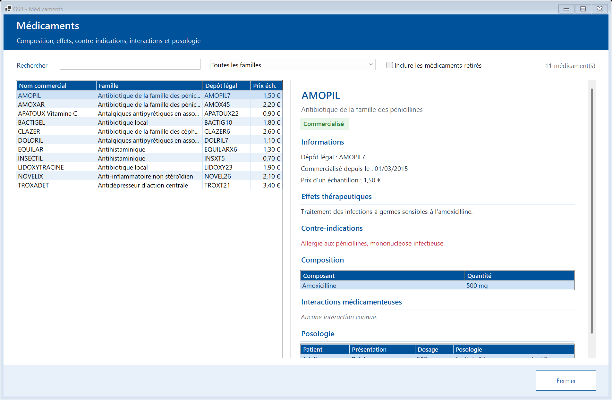
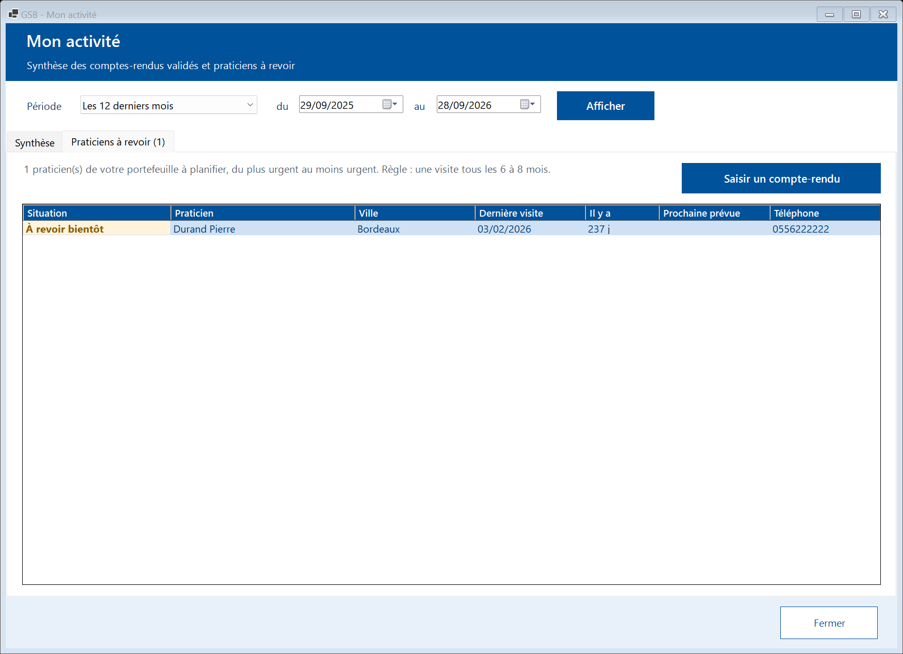

# Module Visiteur

[← Sommaire](README.md)

Ce module sert à saisir ses comptes-rendus de visite et à préparer ses tournées. Le délégué régional dispose des mêmes fonctions, car il fait aussi des visites.

## 1. Mes comptes-rendus

La tuile **« Mes comptes-rendus »** liste vos comptes-rendus des **trois dernières années**, du plus récent au plus ancien.

- **« Afficher »** : tous les comptes-rendus, seulement les « Brouillons à terminer » ou seulement les « Comptes-rendus validés ».
- **« Praticien »** : tapez une partie du nom ou de la ville pour filtrer la liste.
- La colonne **« Remplaçant vu »** indique la personne réellement rencontrée quand le titulaire était remplacé.
- **« Ouvrir »** (ou double-clic sur une ligne) : consulter ou modifier le compte-rendu.
- **« Supprimer le brouillon »** : uniquement pour un brouillon. Un compte-rendu validé ne se supprime jamais.

## 2. Saisir un compte-rendu

Cliquez sur **« Nouveau compte-rendu »**. Le compte-rendu est automatiquement rattaché à vous : l'auteur ne peut jamais être modifié.

### Partie « Visite »

1. **Praticien visité (titulaire du cabinet)** : choisissez-le dans **votre portefeuille** (liste triée par nom).
2. **Remplaçant** : si la personne rencontrée n'est pas le titulaire, cochez « La personne rencontrée est un remplaçant » et choisissez-la. S'il n'existe pas encore, **« Nouveau… »** ouvre la fiche à créer (nom, prénom, type, téléphone, e-mail), puis **« Créer la fiche »**. Le compte-rendu garde les deux : le praticien du cabinet et la personne réellement vue.
3. **Date de la visite** : elle ne peut pas être dans le futur.
4. **Motif** : Périodicité, Nouveautés / actualisation, Remontage (baisse de prescription), Sollicitation du praticien ou **Autre**. Pour « Autre », la **précision** devient obligatoire.

### Produits et échantillons

5. **Produits présentés** : **2 au maximum**, et deux produits différents.
6. **Échantillons offerts** : choisissez le produit, la quantité (à l'unité près), puis **« Ajouter »**. La liste est indépendante des produits présentés. **« Retirer »** enlève la ligne sélectionnée.

### Partie « Bilan »

7. **Bilan de la visite** : texte libre (le nombre de caractères s'affiche dessous).
8. **Confiance du praticien dans les produits GSB** : de 1 « Très réticent » à 5 « Très confiant ».
9. **Prochaine visite prévue le** : cochez la case pour planifier la visite suivante (date postérieure à la visite).

### Enregistrer

- **« Enregistrer le brouillon »** : pour terminer plus tard. Seuls le praticien et la date sont exigés. Un brouillon n'est **pas compté** dans les statistiques.
- **« Valider le compte-rendu »** : le compte-rendu est complet et compte dans les statistiques. Motif, bilan et confiance sont alors obligatoires.
- **« Fermer »** : quitte sans enregistrer (une confirmation est demandée si vous avez saisi quelque chose).

Si la saisie est incomplète ou incohérente, rien n'est enregistré et les erreurs s'affichent en rouge sous le formulaire :

Les dates de saisie, de modification et de validation sont enregistrées automatiquement, ainsi que le **temps passé** à chaque ouverture du formulaire.

## 3. Modifier un compte-rendu

Ouvrez le compte-rendu depuis la liste, modifiez-le, puis enregistrez.

- Un **brouillon** peut être complété puis validé.
- Un compte-rendu **validé** reste modifiable, mais ne peut plus repasser en brouillon.
- Seule la dernière version est conservée ; la date de dernière modification est mise à jour.

## 4. Praticiens

La tuile **« Praticiens »** affiche les fiches des praticiens.

- **« Rechercher »** : nom, prénom ou ville.
- **« Seulement mon portefeuille »** (coché par défaut) : décochez pour voir tous les praticiens. **« Inclure les praticiens inactifs »** affiche aussi ceux qui ne sont plus suivis.
- Sélectionnez une ligne pour afficher la fiche : coordonnées, type, spécialités et coefficients, visiteur qui le suit, **date de la dernière visite**, prochaine visite conseillée et historique des visites.
- La colonne **« Périodicité »** signale d'un coup d'œil les praticiens à revoir.

## 5. Médicaments

La tuile **« Médicaments »** présente la fiche de chaque produit : famille, composition, effets, contre-indications, interactions et posologie. Recherchez par nom commercial ou dépôt légal, filtrez par famille ; « Inclure les médicaments retirés » affiche aussi les produits qui ne sont plus commercialisés.

## 6. Mon activité

La tuile **« Mon activité »** fait la synthèse de vos comptes-rendus **validés** sur une période.

1. Choisissez une **période** (« Ce mois-ci », « Le mois dernier », « Les 3 derniers mois », « Les 12 derniers mois », « Les 3 dernières années ») ou saisissez vos propres dates (trois ans au plus).
2. Cliquez sur **« Afficher »**.

La synthèse donne le nombre de visites, les praticiens vus, la confiance moyenne, les échantillons distribués et leur coût, le temps moyen de saisie et les brouillons à terminer. Suivent les visites par mois (graphique et tableau), la répartition par motif et les produits présentés.

### Praticiens à revoir

Un praticien doit être visité **tous les 6 à 8 mois**. L'onglet **« Praticiens à revoir »** liste les praticiens de votre portefeuille à planifier, **du plus urgent au moins urgent** : plus de 8 mois sans visite, jamais visités, visite prévue dépassée, puis 6 à 8 mois.

Sélectionnez un praticien puis **« Saisir un compte-rendu »** pour ouvrir directement la saisie avec ce praticien.
