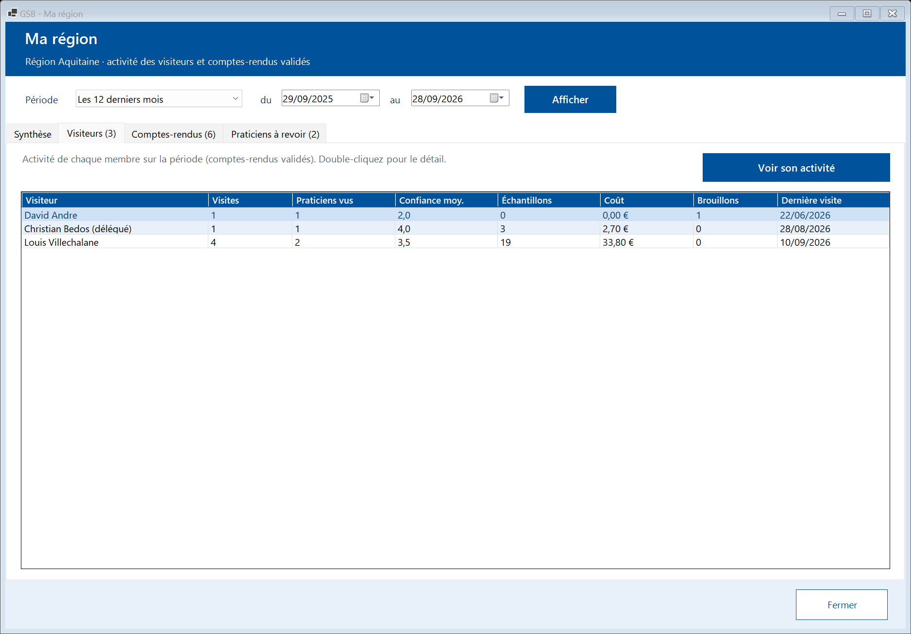
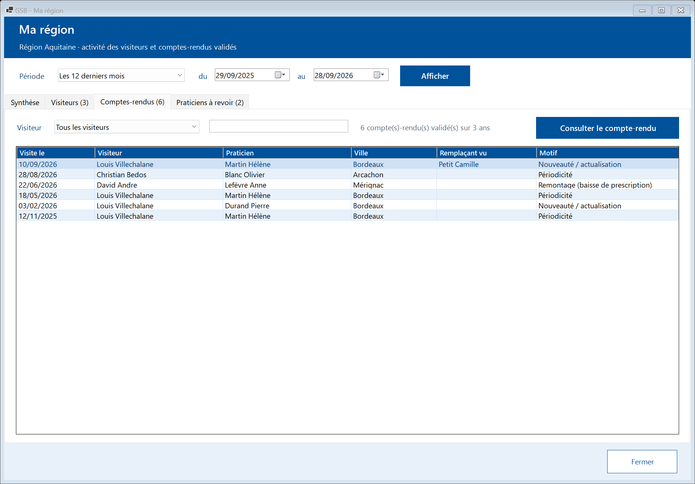
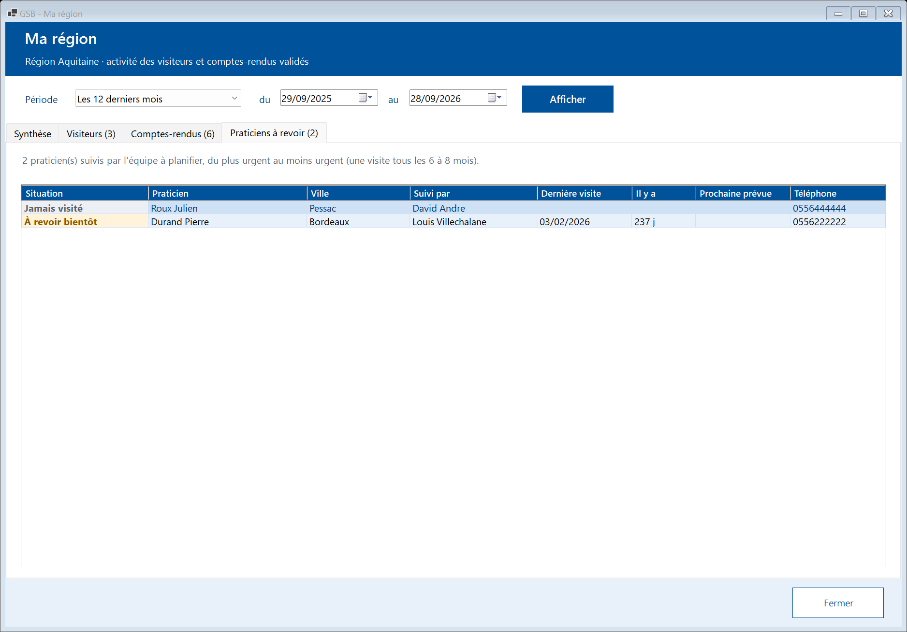
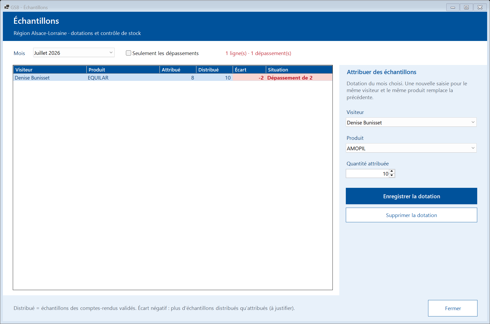

# Module Délégué régional

[← Sommaire](README.md)

Le délégué régional dispose de **toutes les fonctions du visiteur** (voir [Module Visiteur](02-visiteur.md)) et, en plus, du suivi de sa région et des échantillons.

## 1. Ma région

La tuile **« Ma région »** montre l'activité des visiteurs de votre région. Choisissez une **période** puis **« Afficher »**. Seuls les comptes-rendus **validés** sont comptés.

### Synthèse

Indicateurs de la région sur la période (visites, praticiens vus, confiance moyenne, échantillons et coût, temps de saisie, brouillons en attente) et visites par mois.

### Visiteurs

Activité de chaque visiteur : visites, praticiens vus, confiance, échantillons, coût, brouillons et date de la dernière visite. Un visiteur **sans aucune visite** sur la période est signalé.

Sélectionnez un visiteur puis **« Voir son activité »** (ou double-clic) pour afficher sa synthèse détaillée.

### Comptes-rendus

Tous les comptes-rendus validés des visiteurs de la région. Filtrez par visiteur ou par praticien, puis **« Consulter le compte-rendu »** pour le lire. Les comptes-rendus des autres visiteurs sont en **lecture seule**, et leurs brouillons ne sont pas visibles.

### Praticiens à revoir

Praticiens suivis par l'équipe qui doivent être revus (plus de 8 mois sans visite en priorité), avec le visiteur qui les suit.

## 2. Échantillons

La tuile **« Échantillons »** sert à attribuer les échantillons aux visiteurs de la région et à contrôler le stock.

### Attribuer des échantillons (dotation mensuelle)

1. Choisissez le **mois** en haut de la fenêtre.
2. Dans « Attribuer des échantillons », choisissez le **visiteur** (uniquement ceux de votre région), le **produit** et la **quantité attribuée**.
3. Cliquez sur **« Enregistrer la dotation »**.

Une nouvelle saisie pour le même visiteur, le même produit et le même mois **remplace** la précédente. **« Supprimer la dotation »** l'annule.

### Contrôler le stock

Le tableau compare, pour chaque visiteur et chaque produit du mois :

- **Attribué** : la dotation saisie par le délégué ;
- **Distribué** : les échantillons déclarés dans les comptes-rendus validés ;
- **Écart** : attribué moins distribué.

Un **écart négatif** (plus d'échantillons distribués qu'attribués) apparaît en rouge avec la mention « Dépassement » : il doit être justifié avec le visiteur. Cochez **« Seulement les dépassements »** pour n'afficher que ces lignes.
