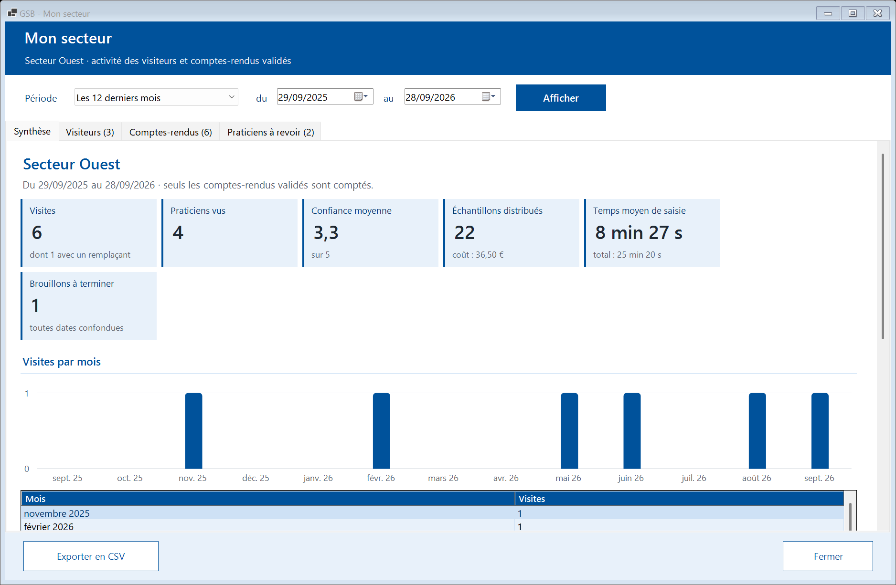
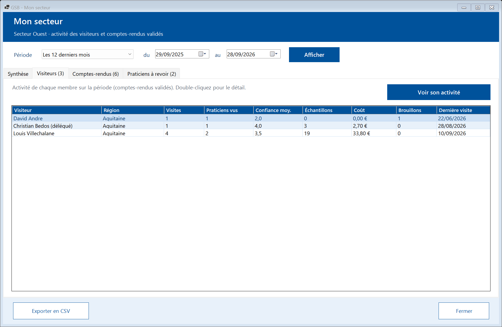

# Module Responsable de secteur

[← Sommaire](README.md)

## 1. Mon secteur

La tuile **« Mon secteur »** fonctionne comme « Ma région » du délégué, mais pour **toutes les régions de votre secteur**. Choisissez une **période** puis **« Afficher »**.

- **Synthèse** : indicateurs du secteur et visites par mois.
- **Visiteurs** : activité de chaque visiteur, avec sa **région**. Sélectionnez un visiteur puis **« Voir son activité »** pour sa synthèse détaillée.
- **Comptes-rendus** : les comptes-rendus validés de vos subordonnés, filtrables par visiteur et par praticien, en lecture seule.
- **Praticiens à revoir** : praticiens suivis par les visiteurs du secteur qui doivent être revus.
- **« Exporter en CSV »** : enregistre la synthèse du secteur et l'activité de chaque visiteur (avec sa région) dans un fichier lisible par Excel.

## 2. Échantillons

Le responsable **consulte** le contrôle de stock (attribué, distribué, écart, dépassements) de la même façon que le délégué (voir [Module Délégué](03-delegue.md#2-échantillons)), mais **ne saisit pas** de dotation : c'est le rôle du délégué régional.

## 3. Praticiens et médicaments

Les fiches praticiens et médicaments sont consultables comme pour le visiteur (voir [Module Visiteur](02-visiteur.md#4-praticiens)).
