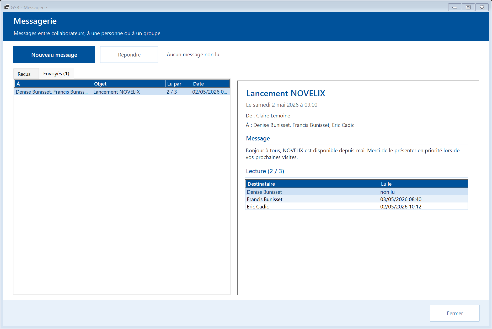

# Messagerie

[← Sommaire](README.md)

La messagerie interne permet d'échanger avec un collaborateur ou avec tout un groupe (une région, un secteur). Elle est accessible à tous les profils.

## Lire ses messages

Le nombre de messages non lus apparaît sur la tuile **« Messagerie »** du menu. Dans le module, l'onglet **« Reçus »** liste les messages ; les **non lus sont en gras**.

Sélectionnez un message pour le lire dans la partie droite : il est alors marqué comme lu.

L'onglet **« Envoyés »** montre vos messages envoyés et, pour chacun, **qui l'a lu et quand**.

## Écrire un message

1. Cliquez sur **« Nouveau message »**.
2. Choisissez les **destinataires** : cochez des personnes dans la liste (la zone au-dessus filtre par nom), ou choisissez un groupe dans **« Ajouter tout un groupe »** puis **« Ajouter »**. « Tout décocher » vide la sélection.
3. Saisissez l'**objet** et le **message**.
4. Cliquez sur **« Envoyer »**.

## Répondre

Sélectionnez un message reçu puis **« Répondre »** : le destinataire, l'objet et le texte d'origine (cité) sont pré-remplis.
