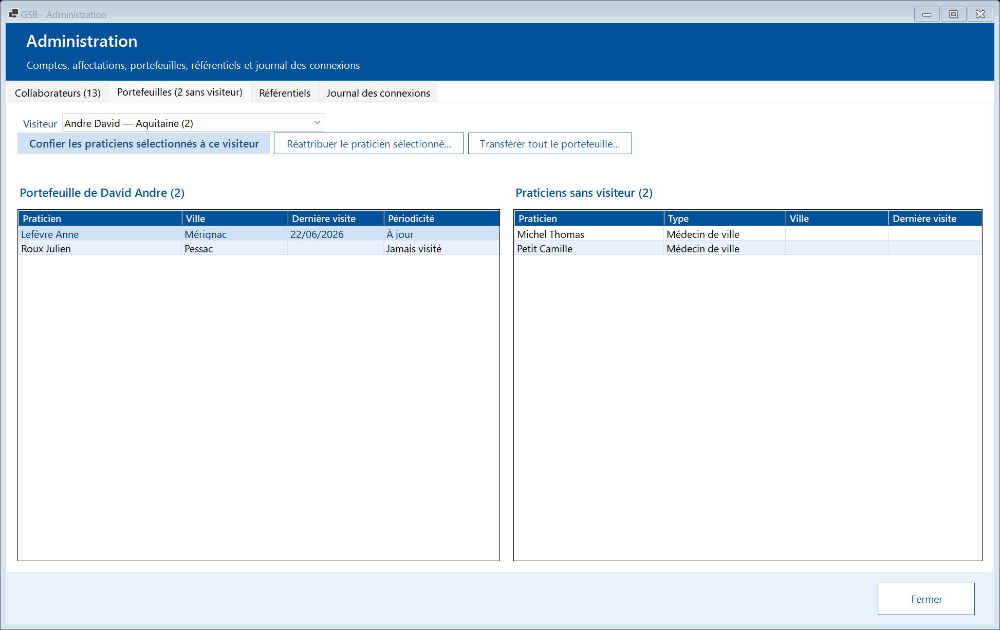
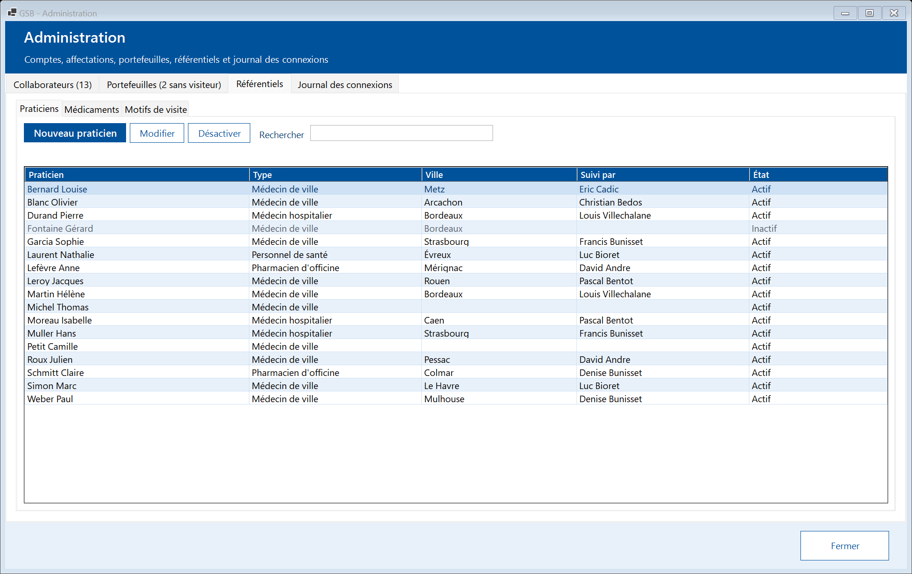
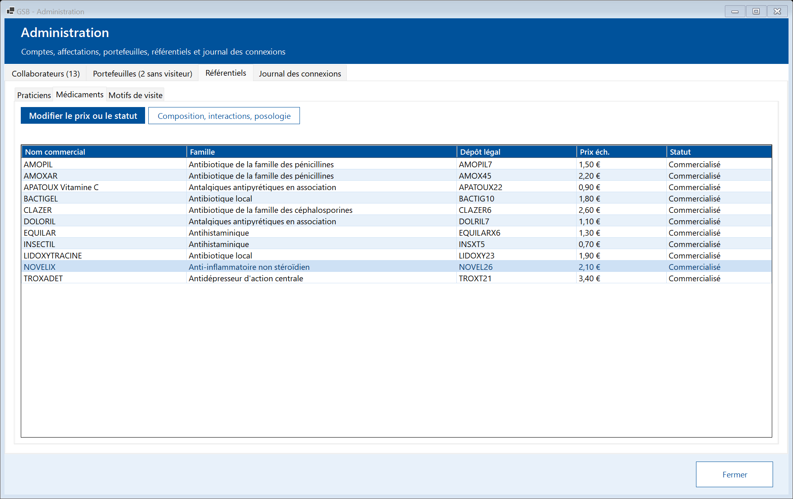
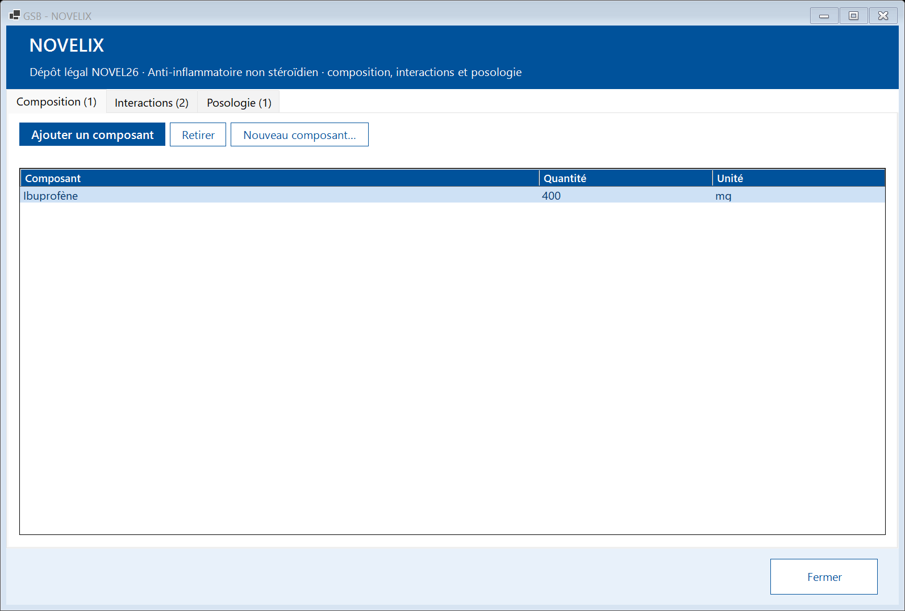
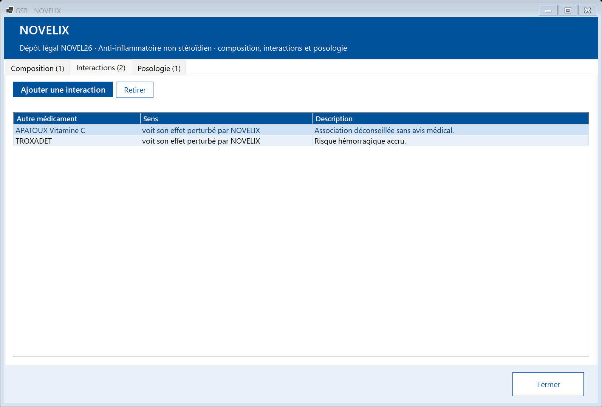
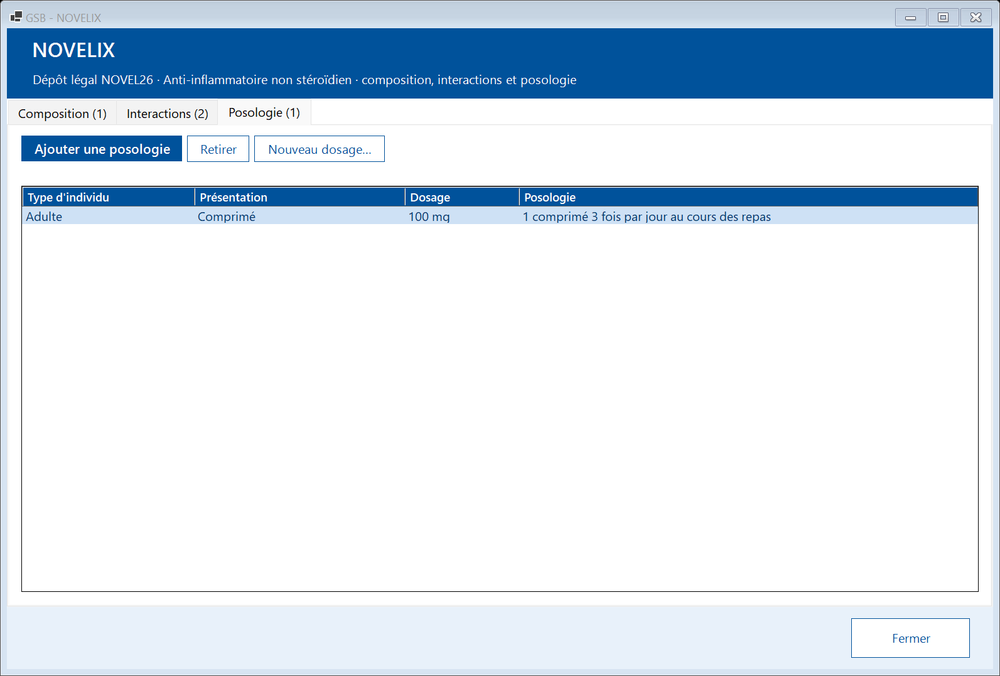
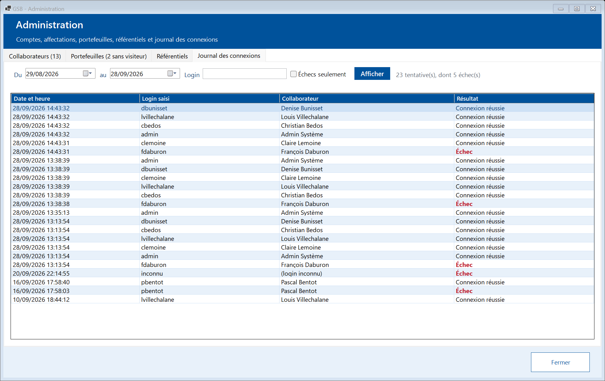

# Module Administration

[← Sommaire](README.md)

Réservé à l'administrateur, ce module gère les comptes des collaborateurs, leurs affectations, les portefeuilles de praticiens, les référentiels et le journal des connexions. Il comporte quatre onglets. Les actions s'effectuent par des boutons au-dessus des listes ; chacune ouvre une petite fenêtre de saisie, dont le bouton bleu confirme. Un message de confirmation s'affiche ensuite en bas de la fenêtre.

## 1. Collaborateurs

La liste indique pour chaque collaborateur son profil, son rattachement, l'état du compte (Actif, Verrouillé, Mot de passe à changer, Parti), sa dernière connexion et la taille de son portefeuille. Sélectionnez un collaborateur pour voir sa fiche à droite (coordonnées, compte, historique des affectations). « Rechercher » filtre la liste ; « Afficher les collaborateurs partis » montre aussi les anciens.

| Action | Mode opératoire |
|---|---|
| **Nouveau collaborateur** | Saisir matricule, nom, prénom, login, coordonnées, date d'embauche, profil et région (visiteur, délégué) ou secteur (responsable). Un **mot de passe provisoire** est généré : il s'affiche **une seule fois** et est copié dans le presse-papiers. Transmettez-le au collaborateur, qui devra le changer à sa première connexion. |
| **Modifier** | Identité, coordonnées et login. Le matricule ne change pas. |
| **Changer d'affectation** | Nouveau profil, région ou secteur, à partir d'une date d'effet. L'affectation précédente est close la veille et reste dans l'historique. Le portefeuille ne suit pas automatiquement : utilisez l'onglet Portefeuilles. |
| **Réinitialiser le mot de passe** | Génère un nouveau mot de passe provisoire (affiché une fois), déverrouille le compte et impose un changement à la connexion suivante. |
| **Verrouiller / Déverrouiller** | Bloque ou rétablit l'accès. Le déverrouillage remet à zéro le compteur d'échecs. |
| **Enregistrer le départ** | Date de départ : le compte ne permet plus de se connecter, l'affectation et le portefeuille sont clos (ses praticiens deviennent « sans visiteur »). Les comptes-rendus sont conservés. Transférez le portefeuille **avant** si possible. |

Garde-fous : un login ou un matricule déjà utilisé est refusé ; l'administrateur ne peut ni verrouiller son propre compte, ni enregistrer son départ, ni se retirer le profil Administrateur.

## 2. Portefeuilles

Un praticien est suivi par **un seul visiteur** à la fois.

1. Choisissez le **visiteur** en haut : son portefeuille s'affiche à gauche, les **praticiens sans visiteur** à droite.
2. Selon le besoin :
   - **« Confier les praticiens sélectionnés à ce visiteur »** : sélectionnez un ou plusieurs praticiens à droite (Ctrl+clic pour une sélection multiple) ;
   - **« Réattribuer le praticien sélectionné… »** : choisir un autre visiteur pour le praticien sélectionné à gauche ;
   - **« Transférer tout le portefeuille… »** : tous les praticiens du visiteur passent au visiteur choisi (par exemple avant un départ).

L'historique des suivis et des visites est toujours conservé.

## 3. Référentiels

- **Praticiens** : « Nouveau praticien », « Modifier », « Désactiver » / « Réactiver ». Un praticien désactivé n'est plus proposé à la saisie des comptes-rendus mais reste visible dans l'historique.
- **Médicaments** : « Modifier le prix ou le statut » (prix de l'échantillon, commercialisé ou retiré) et « Composition, interactions, posologie » (voir ci-dessous).
- **Motifs de visite** : « Nouveau motif » (code et libellé, placé juste avant « Autre ») et « Modifier » (libellé, proposé ou non). Le motif « Autre » ne peut pas être désactivé.

### Composition, interactions et posologie d'un médicament

Dans le sous-onglet **Médicaments**, sélectionnez un médicament puis **« Composition, interactions, posologie »**.

La fenêtre du médicament a trois onglets. Dans chacun, **« Retirer »** supprime la ligne sélectionnée après confirmation.

- **Composition** : « Ajouter un composant » (composant, quantité, unité : mg, g, ml, %…). Un composant ne figure qu'une fois : pour changer sa quantité, retirez-le puis ajoutez-le de nouveau. Composant absent de la liste : **« Nouveau composant… »** (code de 2 à 4 lettres ou chiffres, et nom).
- **Interactions** : « Ajouter une interaction » : choisissez l'autre médicament et le **sens** (le médicament affiché perturbe l'effet de l'autre, ou son effet est perturbé par l'autre), puis décrivez l'effet. L'interaction apparaît aussi sur la fiche de l'autre médicament, dans l'autre sens.

- **Posologie** : « Ajouter une posologie » : type d'individu (adulte, enfant…), présentation (comprimé, sirop…), dosage et texte de la posologie. Une seule posologie par combinaison. Dosage absent de la liste : **« Nouveau dosage… »** (quantité et unité).

Les modifications sont visibles aussitôt dans la fiche **Médicaments** de tous les collaborateurs.

## 4. Journal des connexions

Choisissez une période (**Du / au**), éventuellement un **login**, cochez « Échecs seulement » si besoin, puis **« Afficher »**. Chaque tentative indique la date, le login saisi, le collaborateur correspondant (ou « login inconnu ») et le résultat. Les échecs apparaissent en rouge ; une série d'échecs sur un même compte peut signaler une tentative d'intrusion.
